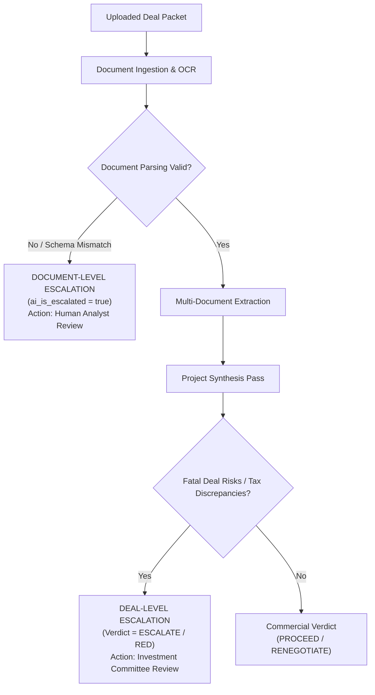

# MergeWorks Financial Due Diligence — Actionable Recommendations & Escalation Guide

This document defines the actionable acquisition recommendations, diligence risk postures, decision thresholds, and escalation architecture utilized across the MergeWorks Financial Due Diligence platform and AI synthesis engine.

---

## 1. Executive Summary & Core Philosophy

In M&A financial due diligence, automated data extraction is only the first step. The ultimate purpose of diligence is to provide the buyer, private equity sponsor, or corporate development team with an **actionable, high-fidelity investment judgment** on whether to:
1. **Proceed** with the acquisition under standard terms.
2. **Renegotiate** the purchase price or structure to reflect quantified risks and unsupportable seller add-backs.
3. **Escalate** the deal immediately to senior Investment Committee members, forensic CPAs, or legal counsel due to fatal structural flaws or fraud.

---

## 2. The Three Primary Risk Postures (Traffic Lights)

Every project synthesis and document review is synthesized into one of three standardized risk postures:

| Posture | Color / Badge | Verdict Family | Core Meaning |
| :--- | :--- | :--- | :--- |
| **GREEN** | `success` (Emerald) | `PROCEED`, `PROCEED TO LOI`, `BUY`, `ACQUIRE`, `APPROVE` | **Low Risk / Clean Findings.** Financials are reliable, historical add-backs are well-documented, customer concentration is diversified, and working capital is adequate. Proceed with standard Phase 2 underwriting. |
| **YELLOW** | `warning` (Amber) | `RENEGOTIATE`, `PROCEED WITH REPRICE`, `PROCEED WITH CAUTION`, `HOLD` | **Moderate Commercial Risk / Price Disconnect.** The target business is fundamentally viable, but seller-claimed adjusted EBITDA contains unsupported add-backs or valuation multiples exceed fair market value. Proceed, but execute a purchase price re-trade or escrow adjustment. |
| **RED** | `destructive` (Ruby) | `ESCALATE`, `WALK AWAY / RESTRUCTURE`, `ABORT`, `PASS`, `NO-GO` | **Severe Structural Risk / Fatal Flaw.** Critical deal-breakers exist (e.g. extreme customer churn, tax fraud, insolvency, unreconciled Form 1120 discrepancies) that exceed normal price renegotiation. Halt LOI signing and escalate to senior leadership or counsel. |

---

## 3. Detailed Actionable Recommendation Glossary

### A. `PROCEED` / `PROCEED TO LOI`
* **Definition**: The target company's earnings quality is verified, tax filings reconcile with management accounts within standard tolerances ($< 5\%$), customer concentration is low ($< 25\%$), and the seller's asking valuation aligns with market EBITDA multiples.
* **Buyer Action Protocol**:
  - Authorize issuance of a formal Letter of Intent (LOI) or proceed to confirmatory legal/commercial diligence.
  - Finalize standard representations, warranties, and working capital pegs.

### B. `RENEGOTIATE` / `PROCEED WITH REPRICE`
* **Definition**: The acquisition remains commercially attractive, but diligence identified specific, quantifiable valuation overstatements or unsupportable seller add-backs (e.g. personal expenses categorized as operational costs, one-off consulting fees treated as ongoing run-rate).
* **Buyer Action Protocol**:
  - Present the seller with the **Adjusted EBITDA Bridge** and **Negotiation Levers Schedule**.
  - Re-trade purchase price downward dollar-for-dollar based on the haircut to normalized EBITDA (e.g. reducing enterprise value from $12.0M to $10.4M).
  - Increase indemnity escrow holdbacks or introduce seller earn-out notes to bridge valuation gaps.

### C. `PROCEED WITH CAUTION`
* **Definition**: No immediate financial misrepresentation is detected, but operational, market, or key-man dependencies warrant heightened oversight (e.g. lack of secondary management tier, aging fixed assets requiring near-term CapEx, or modest customer concentration between 25%–35%).
* **Buyer Action Protocol**:
  - Structure retention packages for key technical and operational personnel.
  - Require pre-closing CapEx commitments or escrow deductions for deferred maintenance.

### D. `ESCALATE` / `WALK AWAY / RESTRUCTURE`
* **Definition**: The deal contains material risks or structural misrepresentations that **cannot be resolved through simple price reductions**. These risks threaten the ongoing solvency, legality, or commercial continuity of the enterprise.
* **Buyer Action Protocol**:
  - **Immediate Freeze**: Halt LOI execution, do not release earnest money deposits, and suspend diligence exclusivity deadlines.
  - **Senior Review**: Escalate the findings memo to the Senior Investment Committee, Managing Partners, Transaction Advisory Legal Counsel, and Forensic CPAs.
  - **Outcome Paths**: Either formally issue a deal termination notice (Walk Away) or enforce comprehensive structural recapitalization (e.g. asset-only carveout, zero cash at close, 100% indemnity escrows).

---

## 4. Deal-Level Escalation vs. Document-Level Escalation

It is critical to distinguish between escalations occurring at the **portfolio/deal synthesis level** versus the **individual document processing level**:



| Dimension | Deal-Level Escalation (`ESCALATE`) | Document-Level Escalation (`needsHumanReview`) |
| :--- | :--- | :--- |
| **Where it occurs** | Project Synthesis / Multi-Document Reconciliation Pass | Document Extraction Node (`n8n` / `Supabase`) |
| **Trigger Cause** | Commercial/Forensic findings (e.g. tax discrepancy, severe concentration, insolvency) | Ingestion/technical anomaly (e.g. corrupted PDF scan, missing schedules, unsupported multi-year table layout) |
| **Target Audience** | Investment Committee, Deal Partners, M&A Counsel | Diligence Operations Analyst, Data Engineer |
| **UI Location** | `AcquisitionJudgmentCallout.tsx`, `DealMemoView.tsx`, `BusinessSnapshotCard.tsx` | `SubmissionHistoryCard.tsx`, `LatestSubmissionSection.tsx` (Error / Review badge) |

---

## 5. Quantitative & Qualitative Decision Thresholds

The MergeWorks synthesis engine applies deterministic and qualitative rules to assign recommendations:

```
                                  [ Diligence Findings ]
                                             |
                   +-------------------------+-------------------------+
                   |                                                   |
        [ Any Fatal Trigger? ]                              [ No Fatal Triggers ]
        - Customer concentration > 60% (no contract)                   |
        - Tax Return vs P&L variance > 25%                             |
        - Debt Service Coverage Ratio (DSCR) < 1.0x         [ Unsupported Add-Backs > 10% ]
        - Undisclosed legal liens / tax evasion                        |
                   |                                           +-------+-------+
                   v                                           |               |
              [ ESCALATE ]                                    Yes              No
         (WALK AWAY / RESTRUCTURE)                             |               |
                                                               v               v
                                                        [ RENEGOTIATE ]   [ PROCEED ]
                                                        (REPRICE LEVER)   (STANDARD LOI)
```

### Quantitative Trigger Metrics:
1. **Customer Concentration**:
   - Single customer $< 25\%$: Normal risk (`PROCEED`).
   - Single customer $25\% - 45\%$: Yellow risk (`RENEGOTIATE` / `PROCEED WITH CAUTION` with customer retention rep).
   - Single customer $> 50\%$ without long-term contracts: Red risk (`ESCALATE` / `WALK AWAY / RESTRUCTURE`).
2. **Add-Back Haircuts**:
   - Rejected add-backs $< 10\%$ of total EBITDA: Yellow risk (`RENEGOTIATE` price adjustment).
   - Rejected add-backs $> 35\%$ of total EBITDA: Severe haircut; may trigger `ESCALATE` if covenant thresholds are breached.
3. **Book-Tax Reconciliation**:
   - Discrepancy between Tax Return (Form 1120) and internal P&L revenue $< 5\%$: Acceptable timing difference.
   - Discrepancy $> 15\%$ unexplained: Red flag; forensic accounting audit required (`ESCALATE`).

---

## 6. Case Studies from Benchmark Datasets

| Benchmark Project | Target Name | Stated EV / EBITDA | AI Verdict | Key Drivers & Escalation Rationale |
| :--- | :--- | :--- | :--- | :--- |
| **`DD-001`** | Cascadia Climate Services | $9.80M (6.2x) | **`PROCEED WITH REPRICE`** | $329k in unsupportable discretionary add-backs rejected. Fair EV reduced to $7.81M (5.2x revised multiple). |
| **`DD-005`** | Juniper Environmental | $14.2M (7.5x) | **`WALK AWAY / RESTRUCTURE`** | 68% revenue concentration with single utility customer subject to non-renewable RFP; looming CapEx deficit. |
| **`DD-010`** | Cobalt Ridge Software | $21.5M (7.8x) | **`WALK AWAY / RESTRUCTURE`** | $1.55M in capitalization of normal operating R&D expenses rejected; actual EBITDA 56% lower than claimed. |
| **`DD-015`** | Quarry Ridge Plastics | $11.85M (5.5x) | **`PROCEED WITH REPRICE`** | $173k in owner excess perks adjusted; fair valuation supported at $8.27M. |
