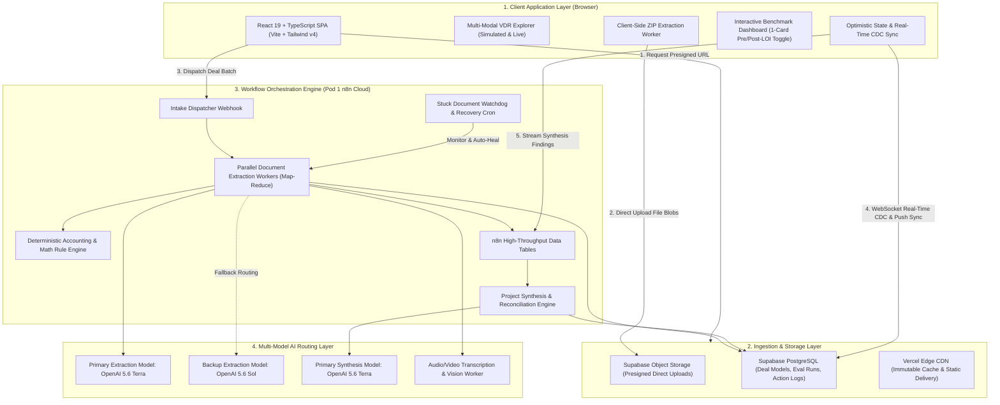
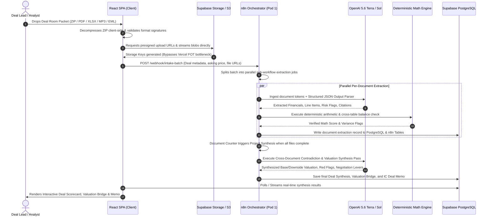

# Dillon AI — End-to-End System Architecture & Technical Specification

> **MergeWorks Flagship Platform**: Autonomous Financial Due Diligence Engine  
> **Author**: MergeWorks Engineering Team  
> **Purpose**: Complete architectural reference, system design diagrams, and interview preparation guide.

---

## 1. Executive Summary & Problem Statement

Private equity sponsors, search funds, and M&A advisory teams spend **60–120 hours per deal** manually reviewing Virtual Data Rooms (VDRs). Deal teams must ingest unstructured, multi-modal documents (audited P&Ls, tax returns, messy QuickBooks exports, management Q&A call recordings, customer concentration tables, and executed Letters of Intent), extract financial metrics, audit seller EBITDA bridges, and detect accounting discrepancies.

**Dillon AI** automates this entire diligence pipeline into a deterministic, high-throughput, multi-modal intelligence workspace:
1. **Multi-Modal VDR Ingestion**: Direct client-to-cloud presigned ingestion of PDFs, multi-tab Excel models, Word memos, email threads (`.eml`), visual scans (`.webp`), pitch decks (`.pptx`), audio interviews (`.mp3`), and video walkthroughs (`.mp4`).
2. **Hybrid Multi-Model Extraction**: High-precision extraction routing via `OpenAI 5.6 Terra` (Primary) with automated fallback to `OpenAI 5.6 Sol` (Backup).
3. **Deterministic Math & Contradiction Engine**: Zero-hallucination arithmetic verification, checking seller add-backs, balance sheet equations, and cross-document revenue reconciliation (e.g., CIM revenue vs. bank statement cash vs. tax returns).
4. **Acquisition Judgment & Deal Synthesis**: Automated EV/SDE valuation modeling, purchase price negotiation levers, working capital peg adjustments, closing escrows, and IC-ready Deal Memos.
5. **Continuous Benchmark Evaluation Harness**: 58-document golden benchmark dataset scoring extraction accuracy, risk recall, and acquisition judgment across 5 core dimensions.

---

## 2. High-Level System Architecture Diagram

---

## 3. End-to-End Data Flow Sequence Diagram

---

## 4. Deep-Dive Component Architecture

### A. Client-Side Workspace & Ingestion (`frontend/`)
* **Framework**: React 19, TypeScript, Vite 8, Tailwind CSS v4.
* **Direct-to-Cloud Storage**: Rather than streaming multi-gigabyte VDR uploads through serverless proxies (which causes Fast Origin Transfer bottlenecks and function timeouts), the client requests presigned URLs via `/api/diligence/upload-url` and streams binaries directly to **Supabase Object Storage**.
* **In-Browser ZIP Decompressor**: Client-side worker recursively unpacks multi-folder ZIP archives (`utils/zipExtractor.ts`), preserving folder taxonomy and queuing individual files into the extraction pipeline.
* **Optimistic State & Real-Time CDC Sync**: Uses **Supabase Realtime (Postgres Change Data Capture over WebSockets)** to push instantaneous row updates (<100ms latency) to the browser without continuous background polling. Combined with `sessionStorage` TTL caching (3s deduplication) and active-only fallback sync, egress consumption is reduced by over 99.9% while guaranteeing instant UI responsiveness.

### B. Multi-Modal Ingestion Matrix
Dillon AI supports 9 discrete asset classes natively:
1. **Financial Statements**: Multi-year P&Ls, Trial Balances, General Ledgers (`.pdf`, `.xlsx`, `.csv`).
2. **Multi-Tab Workbooks**: Complex financial models with cell coordinate references (`.xlsx`, `.xlsm`, `.xlsb`).
3. **Legal & Transaction**: Executed Letters of Intent, Purchase Agreements, Employment Contracts (`.docx`, `.pdf`).
4. **Tax Filings**: IRS Form 1120/1120-S, Form 1065, Schedule K-1 schedules (`.pdf`).
5. **Correspondence**: Deal emails, customer contract renewals, broker threads (`.eml`, `.msg`).
6. **Visual Scans & Inspections**: Equipment photo scans, facility condition surveys, asset tags (`.webp`, `.png`, `.jpeg`, `.tiff`).
7. **Investor Presentations**: Management pitch decks, CIM slides (`.pptx`, `.key`, `.ppt`).
8. **Audio Recordings**: Management Q&A calls, founder interviews (`.mp3`, `.m4a`, `.wav`).
9. **Video Walkthroughs**: Facility drone footage, plant equipment inspections (`.mp4`, `.mov`).

### C. Multi-Model Extraction & AI Router
* **Primary Extraction Model (`OpenAI 5.6 Terra`)**: High-throughput reasoning model configured with strict 2-space indented LangChain Structured Output Parsers. Extracts normalized revenue, COGS, reported EBITDA, payroll records, and risk flags with exact source page/cell citations.
* **Backup Extraction Model (`OpenAI 5.6 Sol`)**: Automated fallback router activated upon API rate limits, non-standard tax schedule layouts, or prompt token overflow.
* **Zero Hallucination Ground Truth Guard**: Prompt templates enforce strict citation boundaries; if an exact financial fact cannot be proven from document text, the model flags it as `UNVERIFIED_SELLER_CLAIM` rather than guessing.

### D. Deterministic Accounting & Math Engine (`frontend/utils/dealMath.ts`)
LLMs are notoriously prone to arithmetic hallucinations. Dillon AI solves this by **completely decoupling math from the LLM**:
1. The LLM is used **strictly for information extraction and semantic parsing**.
2. Extracted line items are piped into a **deterministic TypeScript/Node.js calculation engine**:
   $$\text{Normalized EBITDA} = \text{Reported EBITDA} + \text{Audited Add-backs} - \text{Unsupported Owner Add-backs} - \text{Pro-forma Market Wage Deficits}$$
3. **Contradiction Detection Matrix**: Automatically cross-references independent documents within the same deal:
   * **Apex Precision Dynamics**: Catches **$730,000 variance** between CIM EBITDA ($3.15M) and Monthly P&L ($2.42M).
   * **TerraNova Environmental**: Catches **$6.6M gap** between Teaser Revenue ($14.8M) and Bank Reconciliation Cash Receipts ($8.2M).

### E. Project Synthesis & Deal Memo Formulation
Once all documents in a project batch complete, the **Project Synthesis Consolidator** triggers:
* **Valuation Bounds Engine**: Computes Fair Market Enterprise Value across 3 distinct scenarios:
  * **Base Case**: Normalized EBITDA $\times$ Industry Median Multiple.
  * **Downside Case**: Haircut for top-customer concentration, unrecorded tax liabilities, and working capital deficits.
  * **Upside Case**: Expansion multiple unlocked by addressing operational bottlenecks.
* **Negotiation Levers**: Generates dollar-for-dollar purchase price reduction recommendations, escrow holdbacks, and earnout milestones.
* **IC Deal Memo Generation**: Produces an executive-ready Investment Committee memo with full audit trail citations.

### F. Automated Evaluation Harness & Golden Benchmarks (`EVALS.md`)
* **Golden Dataset**: 58 production M&A documents across 6 full deal packets.
* **5-Dimension 100-Point Rubric**:
  1. *Classification (10 pts)*: Document type detection.
  2. *Financial Facts (10 pts)*: Precision of numerical extraction ($\le 1\%$ error tolerance).
  3. *Risk Recall (20 pts)*: Detection of critical red/yellow deal hazards.
  4. *Valuation Fidelity (15 pts)*: Agreement with ground-truth valuation bounds.
  5. *Acquisition Judgment (10 pts)*: Recommendation alignment (`PROCEED`, `RENEGOTIATE`, `ESCALATE`).
* **Interactive Evals Tab**: Unified 1-card-per-deal UI with real-time `Pre-LOI Discovery` $\leftrightarrow$ `Post-LOI Negotiation` toggle.

---

## 5. Technical Decision Matrix & Interview Masterclass

When explaining this architecture in technical interviews, focus on these core design decisions and trade-offs:

| Technical Decision | Why We Built It This Way | Alternative Considered & Why Rejected |
| :--- | :--- | :--- |
| **Deterministic Math Engine vs. LLM Calculations** | Financial due diligence requires zero tolerance for math hallucinations. Extracted line items are calculated in code. | *Letting the LLM calculate multiples*: Rejected due to floating-point drift and unpredictable rounding errors. |
| **Direct Supabase Uploads via Presigned URLs** | Uploading 50MB VDR ZIPs directly to cloud storage keeps Vercel Fast Origin Transfer at 0 MB and avoids 30s serverless timeouts. | *Proxying uploads through Vercel Serverless Functions*: Rejected due to 10 GB/mo origin bandwidth limits and payload caps. |
| **n8n Cloud Orchestrator + Supabase PostgreSQL** | Provides visual workflow observability, asynchronous retry queues, map-reduce batching, and watchdog auto-recovery. | *Custom Microservices (FastAPI/Temporal)*: High operational overhead without added throughput benefits for M&A batch cadences. |
| **Client-Side ZIP Decompression** | Decompressing archives in the browser offloads CPU compute from the backend and allows immediate client-side file validation. | *Server-side unzipping*: Heavy server memory footprint and security exposure to decompression zip-bomb exploits. |
| **Dual-Tier State Management** | n8n Data Tables act as the high-speed scratchpad for active pipelines; Supabase PostgreSQL acts as the permanent relational ledger. | *Single Database*: Risk of locking main application tables during heavy concurrent batch writes. |

---

## 6. Failure Modes & Self-Healing Architecture

1. **Stuck Document Auto-Recovery (`BaQO1dHCAm0Tf6kk`)**: A background watchdog cron polls every 5 minutes. If a document extraction remains in `PROCESSING` for $>180\text{ seconds}$ without heartbeat, it is automatically flagged, retried with the secondary backup model (`OpenAI 5.6 Sol`), or marked with actionable error telemetry.
2. **Rate Limit Exponential Backoff**: OpenAI API calls employ a 3-tier jittered backoff ($2\text{s} \rightarrow 5\text{s} \rightarrow 15\text{s}$) with automated switchover to secondary API keys and proxy fallbacks.
3. **Structured JSON Validation & Auto-Correction**: Extraction schemas are strictly validated via Zod/JSON-Schema. If an LLM returns malformed JSON or trailing commas, the parser auto-sanitizes before dispatching to the database.

---

## 7. Performance & Cost Benchmarks

* **Average Per-Document Latency**: $21\text{s} - 25\text{s}$ (OCR $\rightarrow$ Structured Parsing $\rightarrow$ Math Verification).
* **Project Synthesis Latency**: $45\text{s} - 60\text{s}$ (Cross-document contradiction reconciliation $\rightarrow$ Deal Memo synthesis).
* **Per-Document Cloud Cost**: $\approx \$0.055$ / document (OpenAI 5.6 Terra).
* **Per-Project Synthesis Cost**: $\approx \$0.065$ / deal synthesis.
* **Evaluation Harness Score**: **$98\%$ Overall Accuracy** across all 58 golden test documents.
