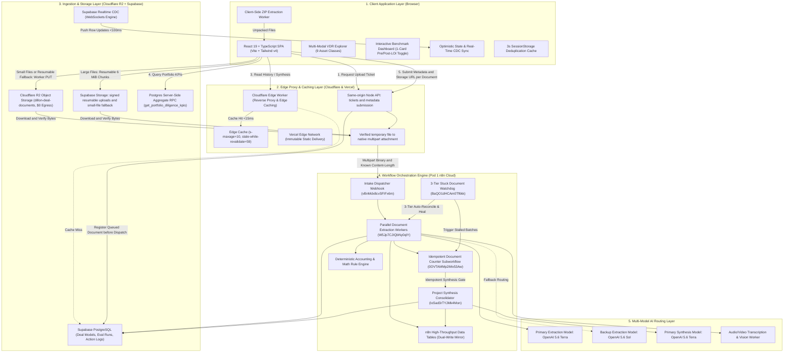
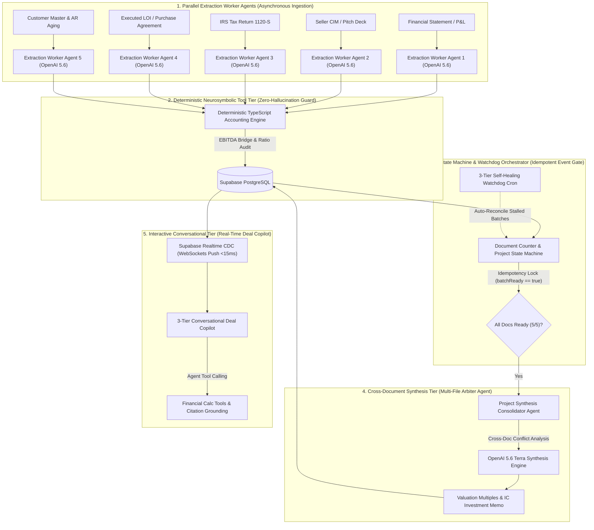

# Dillon AI — End-to-End System Architecture & Technical Specification

> **MergeWorks Flagship Platform**: Autonomous Financial Due Diligence Engine  
> **Author**: MergeWorks Engineering Team  
> **Purpose**: Complete architectural reference, system design diagrams, and interview preparation guide.

---

## 1. Executive Summary & Problem Statement

Private equity sponsors, search funds, and M&A advisory teams spend **60–120 hours per deal** manually reviewing Virtual Data Rooms (VDRs). Deal teams must ingest unstructured, multi-modal documents (audited P&Ls, tax returns, messy QuickBooks exports, management Q&A call recordings, customer concentration tables, and executed Letters of Intent), extract financial metrics, audit seller EBITDA bridges, and detect accounting discrepancies.

**Dillon AI** automates this entire diligence pipeline into a deterministic, high-throughput, multi-modal intelligence workspace:
1. **Multi-Modal VDR Ingestion**: Direct client-to-cloud presigned ingestion of PDFs, multi-tab Excel models, Word memos, email threads (`.eml`), visual scans (`.webp`), pitch decks (`.pptx`), audio interviews (`.mp3`), and video walkthroughs (`.mp4`).
2. **Hybrid Multi-Model Extraction**: High-precision extraction routing via `OpenAI 5.6 Terra` (Primary) with automated fallback to `OpenAI 5.6 Sol` (Backup).
3. **Deterministic Math & Contradiction Engine**: Zero-hallucination arithmetic verification, checking seller add-backs, balance sheet equations, and cross-document revenue reconciliation (e.g., CIM revenue vs. bank statement cash vs. tax returns).
4. **Acquisition Judgment & Deal Synthesis**: Automated EV/SDE valuation modeling, purchase price negotiation levers, working capital peg adjustments, closing escrows, and IC-ready Deal Memos.
5. **Continuous Benchmark Evaluation Harness**: 58-document golden benchmark dataset scoring extraction accuracy, risk recall, and acquisition judgment across 5 core dimensions.

---

## 2. High-Level System Architecture Diagram



---

## 3. Distributed Event-Driven Multi-Agent Pipeline Architecture

Dillon AI implements a distributed, 5-tier multi-agent pipeline designed for high-throughput Virtual Data Room (VDR) ingestion, mathematical integrity, and autonomous acquisition judgment without token explosion:



### 5-Tier Multi-Agent System Roles & Contracts

| Agent / Tier | Archetype | Responsibilities | Latency & SLA |
| :--- | :--- | :--- | :--- |
| **Tier 1: Document Extraction Workers** | Parallel Worker Agents | Ingests multi-modal VDR files, classifies document taxonomy, extracts financial metrics, and generates page-level citation anchors. Fallback routing from `OpenAI 5.6 Terra` to `OpenAI 5.6 Sol`. | $21\text{s} - 25\text{s}$ per doc (Parallel) |
| **Tier 2: Accounting Guardrail Tool** | Deterministic Neurosymbolic Engine | Audits reported EBITDA, verifies arithmetic balance sheets, computes add-back haircuts, and calculates debt coverage ratios in native code to eliminate LLM arithmetic hallucinations. | $< 5\text{ms}$ (Native code) |
| **Tier 3: Document Counter & Watchdog** | Event State Coordinator & Self-Healing Agent | Manages batch progression, verifies completion thresholds (e.g. 5/5), acquires distributed idempotency locks to prevent duplicate synthesis runs, and auto-heals stalled documents via background crons. | $< 50\text{ms}$ per state transition |
| **Tier 4: Synthesis Consolidator** | Multi-Document Arbiter Agent | Ingests all extracted document representations simultaneously, cross-examines contradictions (e.g. CIM claims vs. Bank cash vs. Tax returns), calculates Base/Downside/Upside valuation bounds, and authors the IC Deal Memo. | $7\text{s} - 10\text{s}$ (LLM reasoning) |
| **Tier 5: 3-Tier Deal Copilot** | Conversational Tool-Calling Copilot | Interactive chat agent equipped with sliding deal memory, dynamic financial calculation tools, and citation drawer deep-linking for buy-side investment committees. | Streaming $< 200\text{ms}$ TTFT |

---

## 4. End-to-End Data Flow Sequence Diagram

```mermaid
sequenceDiagram
    autonumber
    actor DealTeam as Deal Lead / Analyst
    participant Browser as React SPA (Client)
    participant CF as Cloudflare Edge Worker
    participant API as Same-origin Node API
    participant Storage as Supabase Storage / R2 Worker
    participant n8n as n8n Orchestrator (Pod 1)
    participant LLM as OpenAI 5.6 Terra / Sol
    participant Math as Deterministic Math Engine
    participant DB as Supabase PostgreSQL (RPC / CDC)

    DealTeam->>Browser: Drops Deal Room Packet (ZIP / PDF / XLSX / MP3 / EML)
    Browser->>Browser: Decompresses ZIP client-side & validates format signatures
    Browser->>Browser: Save expected count and upload-attempt manifest
    Browser->>API: POST /api/diligence/upload-url
    API-->>Browser: Scoped storage ticket and object path
    Browser->>Storage: Upload directly; large files use resumable 6 MiB chunks
    Storage-->>Browser: Upload confirmed
    Browser->>API: POST /api/diligence/submit (metadata and storage URL)
    API->>DB: Register queued document before dispatch
    API->>Storage: Download stored file
    Storage-->>API: File bytes to private temporary disk
    API->>API: Verify byte count before opening n8n request
    API->>n8n: POST submit webhook (native multipart binary attachment)
    n8n-->>API: Document acceptance acknowledgment
    API->>API: Validate acknowledgment and clean temporary files
    API-->>Browser: Accepted request ID
    Note over API,n8n: No automatic resend after ambiguous send or acknowledgment failure
    
    par Parallel Per-Document Extraction
        n8n->>LLM: Ingest document tokens + Structured JSON Output Parser
        LLM-->>n8n: Extracted Financials, Line Items, Risk Flags, Citations
        n8n->>Math: Execute deterministic arithmetic & cross-table balance check
        Math-->>n8n: Verified Math Score & Variance Flags
        n8n->>DB: Write document extraction record to PostgreSQL & n8n Tables
    end

    n8n->>n8n: Document Counter checks Project State (Idempotency Lock)
    n8n->>LLM: Execute Cross-Document Contradiction & Valuation Synthesis Pass
    LLM-->>n8n: Synthesized Base/Downside Valuation, Red Flags, Negotiation Levers
    n8n->>DB: Save final Deal Synthesis, Valuation Bridge, and IC Deal Memo
    
    DB-->>Browser: Instant Push via Supabase Realtime CDC (<100ms)
    Browser->>CF: Query History & Synthesis (Served from Edge Cache / ETag)
    Browser->>DB: RPC get_portfolio_diligence_kpis (<2ms, <400B payload)
```

---

## 5. Deep-Dive Component Architecture

### A. Client-Side Workspace & Ingestion (`frontend/`)
* **Framework & Tooling**: React 19, TypeScript, Vite 8, Tailwind CSS v4.
* **TanStack Query & Table Architecture**:
  - **`@tanstack/react-query` (v5)**: Manages all asynchronous server state with a unified `QueryClient` (`staleTime: 10,000ms`, `gcTime: 300,000ms`, `refetchOnWindowFocus: true`). Eliminates redundant network calls, manages background refetches, and provides typed hooks (`useSubmissionHistoryQuery`, `useProjectSynthesisQuery`, `usePortfolioKpisQuery`, `useDealModelsQuery`).
  - **`@tanstack/react-table`**: Powers high-performance, virtualized, multi-column sorting and filtering across deal history and financial fact reconciliation tables.
* **Direct Storage Uploads**: The client requests tickets via `/api/diligence/upload-url`. Files larger than 6 MiB prefer signed resumable Supabase uploads in 6 MiB chunks on the direct storage host. Smaller files prefer the R2 Worker; the providers remain alternatives if one upload path fails. Supabase upload URLs bypass the Cloudflare proxy. Only files at most 3 MiB may fall back to inline base64 after storage fails.
* **Verified Server Handoff**: After storage succeeds, `/api/diligence/submit` receives metadata and a URL, registers the document, then downloads it to a private temporary file and verifies its size. Native FormData sends a disk-backed Blob with a known Content-Length to n8n. Local and deployed runtimes share `backend/diligence/documentHandoff.ts`; temporary attachments are cleaned up on success or failure, with a 256 MiB aggregate limit per handoff. Download, send, and acknowledgment share a 180-second deadline inside the configured 300-second Vercel function budget. The file bypasses the inbound API body, not the outbound server-to-n8n transfer.
* **Batch State and Failure Visibility**: A session-persisted upload manifest retains attempts that never reached the database. It contains metadata, not document bytes or keys. Expected counts never shrink to received counts; progress and timer logic derive from the same batch state. Failed carousel cards retain partial results and show unavailable fields. Display-only failed attempts are not synthesis evidence. See [Upload and Batch Recovery](docs/UPLOAD_AND_BATCH_RECOVERY.md).
* **In-Browser ZIP Decompressor**: Client-side worker recursively unpacks multi-folder ZIP archives (`utils/zipExtractor.ts`), preserving folder taxonomy and queuing individual files into the extraction pipeline.
* **Optimistic State & Real-Time CDC Sync**: Uses **Supabase Realtime (Postgres Change Data Capture over WebSockets)** to push instantaneous row updates (<100ms latency) to the browser without continuous background polling. When a CDC event arrives, it automatically invalidates TanStack Query in-memory caches, reducing egress by over 99.9% while guaranteeing instant UI responsiveness.

### B. Cloudflare Edge Worker & Reverse Proxy Layer (Steps A & C)
* **REST Edge Reverse Proxy (Step A)**: High-performance Cloudflare Worker sitting in front of REST read endpoints (`/api/diligence/history`, `/api/diligence/synthesis`, benchmark feeds) with `Cache-Control: public, s-maxage=10, stale-while-revalidate=59` and ETags, serving repeated reads from global Edge PoPs in sub-15ms.
* **R2 Storage and Legacy Supabase Caching (Step C)**: The worker (`dillon-ai-worker`) handles PUT uploads and GET reads for R2 and caches legacy Supabase public-object requests that pass through it. New signed Supabase upload/public URLs remain independent of that proxy; those direct downloads are not covered by its cache.
* **DDoS & Origin Protection**: Absorbs concurrent user refreshes and automated benchmark evaluation runs, preventing high query volume from hitting Supabase PostgreSQL or triggering serverless function invocation limits.

### C. Postgres Server-Side Aggregate RPC & Egress Optimization (Step B)
* **Stored Procedure Aggregations (`get_portfolio_diligence_kpis`)**: Replaced multi-megabyte client-side table aggregations (which previously downloaded entire historical records for 88+ projects and 700+ documents) with a native PostgreSQL RPC. The database computes project totals, document counts, status breakdowns, and financial sums in sub-2ms and returns a compact JSON payload (<400 bytes), slashing network payload size by **99.8%**.
* **Lightweight Column Projections**: Endpoints like `getSubmissionHistory.ts` utilize optimized projection queries (`lightweightColumns`), selecting essential metadata and visual flags (`ai_red_flags`, `ai_yellow_flags`, `ai_green_flags`, `ai_summary`) while excluding heavy multi-megabyte `ai_extractedJson` payloads until an analyst opens a specific document Evidence Drawer.
* **Full Portfolio Navigation Scope**: Sets a global limit of 1,000 for top-level history queries, ensuring all 88 projects are immediately searchable and selectable in workspace dropdowns without pagination clipping.

### D. Multi-Modal Ingestion Matrix
Dillon AI supports 9 discrete asset classes natively:
1. **Financial Statements**: Multi-year P&Ls, Trial Balances, General Ledgers (`.pdf`, `.xlsx`, `.csv`).
2. **Multi-Tab Workbooks**: Complex financial models with cell coordinate references (`.xlsx`, `.xlsm`, `.xlsb`).
3. **Legal & Transaction**: Executed Letters of Intent, Purchase Agreements, Employment Contracts (`.docx`, `.pdf`).
4. **Tax Filings**: IRS Form 1120/1120-S, Form 1065, Schedule K-1 schedules (`.pdf`).
5. **Correspondence**: Deal emails, customer contract renewals, broker threads (`.eml`, `.msg`).
6. **Visual Scans & Inspections**: Equipment photo scans, facility condition surveys, asset tags (`.webp`, `.png`, `.jpeg`, `.tiff`).
7. **Investor Presentations**: Management pitch decks, CIM slides (`.pptx`, `.key`, `.ppt`).
8. **Audio Recordings**: Management Q&A calls, founder interviews (`.mp3`, `.m4a`, `.wav`).
9. **Video Walkthroughs**: Facility drone footage, plant equipment inspections (`.mp4`, `.mov`)

### E. Multi-Model Extraction, 2x2 Failover & AI Router
* **2x2 Multi-Stage Failover Strategy**:
  - **Attempt 0 & 1 (Primary: OpenAI 5.6 Terra)**: Deep financial OCR, strict accounting citation extraction, and reconciliation modeling. If Attempt 0 hits a transient network glitch or rate spike, Attempt 1 performs a fast retry on Terra.
  - **Attempt 2 & 3 (Backup: OpenAI 5.6 Sol)**: High-throughput backup model providing a fresh context and alternative token generation dynamic for difficult or non-standard financial tables.
* **Candidate Completion Accumulator**:
  - If extraction fails across retries due to formatting or JSON quoting errors (e.g., unescaped quotes inside long management citations), the error classifier (`Classify LLM Provider Error`) captures raw completion buffers across all attempts into `failedOutputs: string[]`.
  - Discards transient HTTP error strings (e.g. 429/500) and selects the longest, structurally richest partial completion as `bestFailedOutput`.
* **Emergency LangChain Repair Chain**:
  - If all 4 regular attempts are exhausted, the workflow branches to an **Emergency Repair Chain** (`Basic LLM Chain` with `gpt-5.6-sol` Primary, `gpt-5.6-terra` Fallback, and an auto-fixing `Structured Output Parser`).
  - Repairs syntax, citation quotes, and trailing commas without altering numbers, re-injecting salvaged financial extractions directly into the reconciliation and database persistence pipeline.
* **Zero Hallucination Ground Truth Guard**: Prompt templates enforce strict citation boundaries; if an exact financial fact cannot be proven from document text, the model flags it as `UNVERIFIED_SELLER_CLAIM` rather than guessing.

### F. Deterministic Accounting & Math Engine (`frontend/utils/dealMath.ts`)
LLMs are notoriously prone to arithmetic hallucinations. Dillon AI solves this by **completely decoupling math from the LLM**:
1. The LLM is used **strictly for information extraction and semantic parsing**.
2. Extracted line items are piped into a **deterministic TypeScript/Node.js calculation engine**:
   $$\text{Normalized EBITDA} = \text{Reported EBITDA} + \text{Audited Add-backs} - \text{Unsupported Owner Add-backs} - \text{Pro-forma Market Wage Deficits}$$

### G. Dual Intake Pipeline: Document VDR vs. Quick Deal Questionnaire
Dillon AI supports two complementary ingestion modalities:
1. **Unstructured Multi-Modal VDR Ingestion (Cloud Pipeline)**:
   - For complete diligence rooms: uploaded files are streamed directly to Supabase Object Storage, triggering n8n OCR, multi-model extraction (Terra/Sol), and cross-document synthesis.
2. **Quick Deal Questionnaire Intake (`frontend/utils/manualDealIntake.ts` & `frontend/components/ManualDealIntakeForm.tsx`)**:
   - For fast, pre-LOI screening or when users only have high-level numbers on hand (e.g. broker teasers or initial phone screens).
   - Operates **100% client-side** with zero cloud egress and zero LLM latency:
     - **Normalized EBITDA calculation**: Automatically adjusts for disallowed owner perks, discretionary travel, and replacement management wages.
     - **Balance Sheet Aggregation**: Computes Net Asset Value (NAV), Tangible Net Worth, and debt-to-equity ratios.
     - **Capital Stack Sizing**: Evaluates SBA 7(a) senior debt multiples, seller note coverage, and buyer equity requirements.
     - **Autonomous Acquisition Judgment**: Generates instant GREEN/YELLOW/RED signal scores, strategic flags, and specific negotiation levers.
     - **Immediate Workspace Hydration**: Instantly populates the entire 10-tab Diligence Workspace, Deal Models, and Dillon AI conversational assistant.
3. **Contradiction Detection Matrix**: Automatically cross-references independent documents within the same deal:
   * **Apex Precision Dynamics**: Catches **$730,000 variance** between CIM EBITDA ($3.15M) and Monthly P&L ($2.42M).
   * **TerraNova Environmental**: Catches **$6.6M gap** between Teaser Revenue ($14.8M) and Bank Reconciliation Cash Receipts ($8.2M).

### G. Project Synthesis & Deal Memo Formulation
Once all documents in a project batch complete, the **Project Synthesis Consolidator** (`IoSad3rTYJMk4Mon`) triggers:
* **2x2 Multi-Stage Synthesis Failover Schedule**:
  - **Attempt 0 & 1 (Primary: OpenAI 5.6 Terra)**: Deep M&A valuation modeling, cross-document contradiction analysis, and deal judgment. If Attempt 0 hits a rate limit or network glitch, Attempt 1 executes an immediate retry on Terra.
  - **Attempt 2 & 3 (Backup: OpenAI 5.6 Sol)**: High-throughput backup model providing a fresh context window and fast consolidation.
* **Emergency Synthesis Candidate Salvage**:
  - If all 4 regular runs fail due to schema validation or token formatting errors, the candidate accumulator isolates the longest valid candidate (`bestFailedOutput`).
  - Piped into an **Emergency Synthesis LangChain Repair Chain** (`gpt-5.6-sol` Primary + `gpt-5.6-terra` Fallback + auto-fixing Synthesis Schema Parser).
  - Validated via `Validate Repaired Synthesis Schema` and persisted to Supabase and Data Tables.
* **Valuation Bounds Engine**: Computes Fair Market Enterprise Value across 3 distinct scenarios:
   * **Base Case**: Normalized EBITDA $\times$ Industry Median Multiple.
   * **Downside Case**: Haircut for top-customer concentration, unrecorded tax liabilities, and working capital deficits.
   * **Upside Case**: Expansion multiple unlocked by addressing operational bottlenecks.
* **Negotiation Levers**: Generates dollar-for-dollar purchase price reduction recommendations, escrow holdbacks, and earnout milestones.
* **IC Deal Memo Generation**: Produces an executive-ready Investment Committee memo with full audit trail citations.

### H. Automated Evaluation Harness & Golden Benchmarks (`EVALS.md`)
* **Golden Dataset**: 58 production M&A documents across 6 full deal packets.
* **5-Dimension 100-Point Rubric**:
  1. *Classification (10 pts)*: Document type detection.
  2. *Financial Facts (10 pts)*: Precision of numerical extraction ($\le 1\%$ error tolerance).
  3. *Risk Recall (20 pts)*: Detection of critical red/yellow deal hazards.
  4. *Valuation Fidelity (15 pts)*: Agreement with ground-truth valuation bounds.
  5. *Acquisition Judgment (10 pts)*: Recommendation alignment (`PROCEED`, `RENEGOTIATE`, `ESCALATE`).
* **Interactive Evals Tab**: Unified 1-card-per-deal UI with real-time `Pre-LOI Discovery` $\leftrightarrow$ `Post-LOI Negotiation` toggle.

---

## 6. Technical Decision Matrix & Interview Masterclass

When explaining this architecture in technical interviews, focus on these core design decisions and trade-offs:

| Technical Decision | Why We Built It This Way | Alternative Considered & Why Rejected |
| :--- | :--- | :--- |
| **Deterministic Math Engine vs. LLM Calculations** | Financial due diligence requires zero tolerance for math hallucinations. Extracted line items are calculated in code. | *Letting the LLM calculate multiples*: Rejected due to floating-point drift and unpredictable rounding errors. |
| **Multi-Tier Model Failover + Emergency Candidate JSON Salvage** | Ensures 99.9%+ pipeline resilience against rate limits, schema syntax errors, and LLM JSON quirks across both per-doc and deal synthesis workflows. | *Single-model or single-retry architecture*: Rejected due to unacceptable document drop rates during provider outages. |
| **Server-Side Postgres RPC Aggregation (`get_portfolio_diligence_kpis`)** | Calculates all portfolio totals in sub-2ms in the database, reducing client payload from 180KB+ to <400 bytes (99.8% bandwidth cut). | *Client-side aggregation over raw tables*: Rejected due to massive egress consumption and slow rendering with 88+ projects. |
| **Cloudflare Edge Worker & S-Maxage Caching** | Serves high-frequency history and benchmark reads in sub-15ms from the edge, protecting Supabase database connections from traffic spikes. | *Direct origin queries without edge cache*: Rejected due to database connection exhaustion during multi-analyst sessions. |
| **Resumable Direct Uploads + Staged Handoff** | Keep large documents out of the inbound API body; resume interrupted browser uploads; verify the stored file before sending a known-length multipart attachment to n8n. | Inline base64 increases payload size. Directly piping the download into n8n couples two transfers and makes failures harder to locate. Temporary staging uses disk and adds a download phase; outbound bytes still cross the server. |
| **n8n Cloud Orchestrator + Supabase PostgreSQL** | Provides visual workflow observability, asynchronous retry queues, map-reduce batching, and watchdog auto-recovery. | *Custom Microservices (FastAPI/Temporal)*: High operational overhead without added throughput benefits for M&A batch cadences. |
| **Client-Side ZIP Decompression** | Decompressing archives in the browser offloads CPU compute from the backend and allows immediate client-side file validation. | *Server-side unzipping*: Heavy server memory footprint and security exposure to decompression zip-bomb exploits. |
| **Dual-Tier State Management** | n8n Data Tables act as the high-speed scratchpad for active pipelines; Supabase PostgreSQL acts as the permanent relational ledger. | *Single Database*: Risk of locking main application tables during heavy concurrent batch writes. |

---

## 7. Failure Modes & Self-Healing Architecture

**Upload and handoff recovery (2026-08-28):** Storage success is not proof of
n8n acceptance. A storage-download failure occurs before dispatch; a send or
acknowledgment failure may occur after acceptance. Check history before retrying
and never automatically resend an ambiguous submission. Dispatch failures only
update rows still queued, preserving results that already advanced. Failed
uploads remain visible even without a database record. All-success batches show
**Complete**; terminal batches with failures show **Finished with errors**;
missing-document batches show **Incomplete** with a separately frozen timer.
Late arrivals can resume that timer. These changes require no database migration
or n8n workflow rewrite. See the [recovery runbook](docs/UPLOAD_AND_BATCH_RECOVERY.md).

1. **Multi-Stage Retry & Emergency JSON Salvage**:
   - Extraction (`W5Jp7CJIQbNy0qlY`): 2x Terra + 2x Sol retry loop with exponential jitter backoff ($5\text{s} \rightarrow 5\text{s} \rightarrow 10\text{s} \rightarrow 15\text{s}$). If all attempts fail, routes to an emergency LangChain repair chain using the accumulated `bestFailedOutput`.
   - Synthesis (`IoSad3rTYJMk4Mon`): 2x Terra + 2x Sol retry loop with exponential jitter backoff ($5\text{s} \rightarrow 10\text{s} \rightarrow 15\text{s}$). If all attempts fail, routes to the emergency LangChain synthesis repair chain before recording failure in Supabase.
2. **3-Tier Stuck Document Watchdog (`BaQO1dHCAm0Tf6kk`)**: A background watchdog cron runs every 5 minutes with a 3-tier recovery architecture:
   - *Tier 1 (Batch Auto-Reconciliation)*: Identifies batches where all documents completed extraction but synthesis was not triggered, auto-initiating the Consolidator pass.
   - *Tier 2 (Single-Document Recovery)*: Detects documents stuck in `processing` for $>180\text{ seconds}$ without heartbeat, resetting status or routing to the backup model (`OpenAI 5.6 Sol`).
   - *Tier 3 (Reliability Audit & Deduplicated Slack Escalation)*: Suppresses noisy transient alerts using a 30-minute cooldown in `reliability_alert_state`, dispatching to `#pod-1-agent-alerts` only after 3 sustained consecutive failures.
3. **Atomic Synthesis Evidence Claim (`0OVTAMMp2iMx53Aw`)**: The counter canonicalizes the exact terminal document set from request ID, analysis version, and status, then calls the Supabase `claim_project_synthesis` RPC. PostgreSQL uniquely owns `(project_id, evidence_signature)`, so simultaneous document completions produce one winner before `synthesis_pending` or any LLM call. The Consolidator accepts only the claimed manifest, records the signature/run ID on the final version, and marks the claim succeeded or failed. A 15-minute lease recovers executions that disappear without reaching their error path. See [Synthesis Idempotency](docs/SYNTHESIS_IDEMPOTENCY.md).
4. **Database-Validated Auth Alerts**: `frontend/services/supabaseAuth.ts` inspects `session.user.created_at` (< 2 minutes old) rather than browser-local `localStorage` keys, ensuring returning users logging in on new browsers, mobile devices, or private tabs never trigger false "New Account Created" Slack notifications.
5. **Rate Limit Exponential Backoff**: OpenAI API calls employ a 3-tier jittered backoff ($2\text{s} \rightarrow 5\text{s} \rightarrow 15\text{s}$) with automated switchover to secondary API keys and proxy fallbacks.
6. **Structured JSON Validation & Auto-Correction**: Extraction schemas are strictly validated via Zod/JSON-Schema. If an LLM returns malformed JSON or trailing commas, the parser auto-sanitizes before dispatching to the database.

---

## 8. Performance & Cost Benchmarks

* **Average Per-Document Latency**: $21\text{s} - 25\text{s}$ (OCR $\rightarrow$ Structured Parsing $\rightarrow$ Math Verification).
* **Project Synthesis Latency**: $45\text{s} - 60\text{s}$ (Cross-document contradiction reconciliation $\rightarrow$ Deal Memo synthesis).
* **Portfolio KPI Query Latency**: $< 2\text{ms}$ via Postgres RPC (`get_portfolio_diligence_kpis`).
* **Edge Cache Hit Latency**: $< 15\text{ms}$ via Cloudflare Edge Worker.
* **Per-Document Cloud Cost**: $\approx \$0.055$ / document (OpenAI 5.6 Terra).
* **Per-Project Synthesis Cost**: $\approx \$0.065$ / deal synthesis.
* **Network Egress Optimization**: $> 99.8\%$ bandwidth reduction across portfolio and history feeds.
* **Evaluation Harness Score**: **$98\%$ Overall Accuracy** across all 58 golden test documents.
