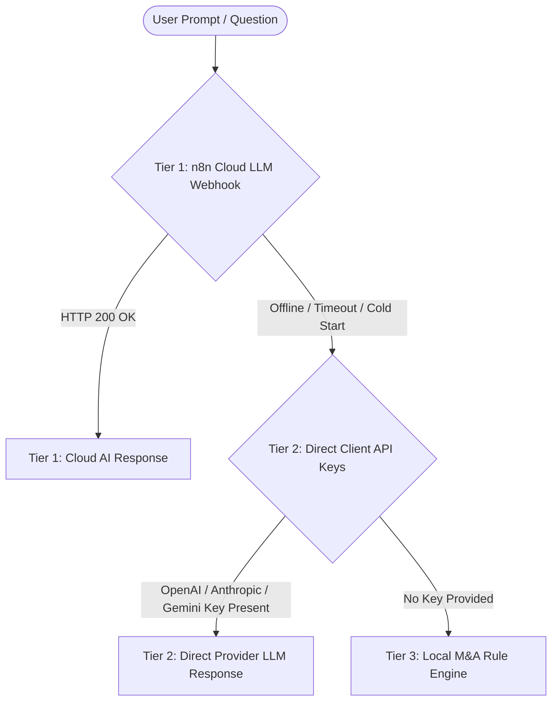

# MergeWorks Dillon AI — Chatbot Architecture & Usage Guide

## 1. Overview & Purpose
**Dillon AI** (`frontend/components/DealChatPanel.tsx`) is an institutional-grade M&A due diligence copilot and versatile AI advisor embedded directly into the MergeWorks Due Diligence Workspace.

It is designed to serve two primary roles seamlessly:
1. **Specialized M&A Deal Copilot**: Ingests real-time workspace financial models, synthesized deal findings, uploaded VDR files, red flags, and valuation parameters to answer complex deal-specific diligence queries and navigate the workspace.
2. **Unconstrained General AI Assistant**: Operates like ChatGPT or Claude, answering generic finance, legal, tax, modeling, email drafting, coding, or conversational questions.

---

## 2. 3-Tier Routing Architecture

To guarantee 100% uptime, zero lock-in, and full conversational flexibility, Dillon AI employs an automatic **3-Tier Intelligent Routing Engine**:



### Response Tier Breakdown & Transparency Badges

Every assistant response displays an explicit **Tier Disclaimer Badge** indicating the engine that generated the answer:

| Tier Badge | Source | Model / Engine | Capabilities |
| :--- | :--- | :--- | :--- |
| `⚡ Tier 1 • Cloud AI` | n8n Enterprise Cloud Webhook (`/dd-chat`) | OpenAI `gpt-4o`, Claude `claude-3-7-sonnet`, Gemini | Full Deal Context + Frontier General Intelligence + Dynamic Tool Ingestion |
| `⚡ Tier 2 • Direct LLM` | Browser Direct API Fetch (`localStorage` keys) | OpenAI (`gpt-4o`), Claude (`claude-3-5-sonnet`), Gemini (`2.5-flash`) | Full Deal Context + Direct Frontier LLM (bypasses cloud webhook downtime) |
| `⚙️ Tier 3 • Local M&A Engine` | Local Deterministic TypeScript Heuristics | Rule-based financial synthesis & prompt classifier | Zero-config offline deal briefings, M&A term definitions, tab navigation |

---

## 3. Context Injection Pipeline

When dispatching prompts to **Tier 1** or **Tier 2**, Dillon AI injects a structured financial dossier into the LLM system prompt via `buildContext()`:

```typescript
function buildContext(
    synthesis?: ProjectSynthesisItem,
    model?: DealModel,
    projectName?: string,
    documents?: SubmissionHistoryItem[],
    allSyntheses?: ProjectSynthesisItem[]
): string
```

### Injected Data Points:
- **Project Identity**: Active Project Name, Project ID, Industry classification.
- **Financial Performance**: Trailing Revenue, EBITDA / SDE, Gross Margin, Operating Margin.
- **Acquisition Terms & Valuation**: Asking Price, Implied Valuation Multiples (EV/EBITDA, EV/Rev).
- **Capital Structure & Debt**: Senior SBA 7(a) Loan, Seller Note %, Buyer Cash Equity %, Target DSCR.
- **Quality of Earnings (QoE)**: Verified Add-backs, Normalization Adjustments, QoE Reliability Score.
- **Red Flags & Key Risks**: Top 5 critical diligence findings, customer concentration, key-person risk.
- **Negotiation Levers**: Valuation bridges, escrow indemnity holdbacks, seller note standstills.
- **VDR Evidence Index**: Document names, OCR extracted facts, and citation cross-references.
- **Deep-Link Protocol**: System instructions forcing the model to cite clickable tab navigation links (e.g. `[Open Scorecard](tab:analysis#analysis-scorecard)`).

---

## 4. Sample Prompts & Capabilities

### A. Executive Deal Briefings & Judgments
- *"Tell me about this deal."* &rarr; Returns an institutional Private Equity deal memo with valuation, red flags, and verdicts.
- *"Should I buy this business?"* &rarr; Synthesizes risk level, margin of safety, and acquisition verdict.
- *"What are the biggest red flags?"* &rarr; Extracts critical deal vulnerabilities with risk mitigations.

### B. Technical M&A & Financial Engineering
- *"What is the DSCR under a 10% interest rate?"* &rarr; Models debt service coverage against lender thresholds.
- *"How does the Working Capital Peg affect purchase price at close?"* &rarr; Explains NWC true-up mechanisms.
- *"What is the difference between SDE and EBITDA for this deal?"* &rarr; Explains owner compensation adjustments.
- *"How should I structure the seller note to meet SBA standby requirements?"* &rarr; Breaks down 24-month SBA standstill rules.

### C. Drafting & Negotiation Support
- *"Draft a professional email to the broker asking for customer concentration breakdown by revenue."*
- *"Draft a Letter of Intent (LOI) cover letter emphasizing seller transition support."*
- *"Give me 5 hard-hitting questions to ask the founder on our first management call."*

### D. Workspace Navigation & Feature Discovery
- *"Where can I see the breakeven analysis?"* &rarr; Deep links directly to `tab:analysis#analysis-breakeven`.
- *"Show me market comps."* &rarr; Deep links directly to `tab:analysis#analysis-market-comps` and `tab:valuation`.
- *"Where is the LOI generator?"* &rarr; Deep links to `tab:analysis#analysis-term-sheet`.

### E. General AI Chat (ChatGPT / Claude Mode)
- *"Explain Section 179 bonus depreciation."*
- *"Write an Excel formula to calculate cumulative debt amortization."*
- *"What is the legal difference between an Asset Purchase Agreement (APA) and a Stock Purchase Agreement (SPA)?"*
- *"Write a Python script to run a Monte Carlo simulation on revenue growth."*

---

## 5. Configuring Custom API Keys (Tier 2)

Users can provide their own LLM API keys directly in the dashboard UI without requiring backend redeployment:

1. Click the **"API Keys"** button in the top navigation bar.
2. Enter any of the following keys:
   - **Anthropic API Key** (`sk-ant-...`) &rarr; Uses `claude-3-5-sonnet-20241022`
   - **OpenAI API Key** (`sk-proj-...`) &rarr; Uses `gpt-4o`
   - **Google Gemini API Key** (`AIzaSy...`) &rarr; Uses `gemini-2.5-flash`
3. Keys are stored locally in the browser's `localStorage` (`mergeworks_user_anthropic_key`, `mergeworks_user_openai_key`, `mergeworks_user_gemini_key`) and never transmitted to third-party databases.

---

## 6. Interactive Deep-Link Protocol

Dillon AI parses markdown links with the `tab:` scheme to navigate the workspace without refreshing:

```markdown
[Anchor Label](tab:<tab_name>#<card_anchor_id>)
```

### Supported Tab Targets:
| Tab Target | Workspace View | Example Anchor ID |
| :--- | :--- | :--- |
| `tab:overview` | Executive Cockpit | `#overview-kpis`, `#overview-timeline` |
| `tab:analysis` | Consolidated Deal Sheet | `#analysis-scorecard`, `#analysis-qoe`, `#analysis-breakeven`, `#analysis-monte-carlo`, `#analysis-term-sheet` |
| `tab:valuation` | Valuation Sandbox | `#valuation-comps`, `#valuation-multiples` |
| `tab:returns` | Returns & Cash Flow | `#returns-irr`, `#returns-waterfall` |
| `tab:growth` | Growth Initiatives | `#growth-scenarios` |
| `tab:structure` | Capital Structure & Debt | `#structure-sources-uses`, `#structure-dscr` |
| `tab:negotiation` | LOI & Negotiation Levers | `#negotiation-levers`, `#negotiation-term-sheet` |
| `tab:diagnostics` | OCR Evidence & Audit | `#diagnostics-vdr`, `#diagnostics-provenance` |

---

## 7. Troubleshooting & Fallback Behavior

- **If responses show `⚙️ Tier 3 • Local M&A Engine`**:
  - The n8n Cloud webhook is either inactive or experiencing cold-start latency.
  - To enable live frontier AI responses immediately, add an OpenAI, Anthropic, or Gemini key in the **API Keys** modal.
- **If responses show `⚡ Tier 1 • Cloud AI`**:
  - The live n8n backend is active and routing through the server-side model.
- **If responses show `⚡ Tier 2 • Direct LLM`**:
  - The browser is communicating directly with OpenAI / Anthropic / Google APIs via your personal API key.
