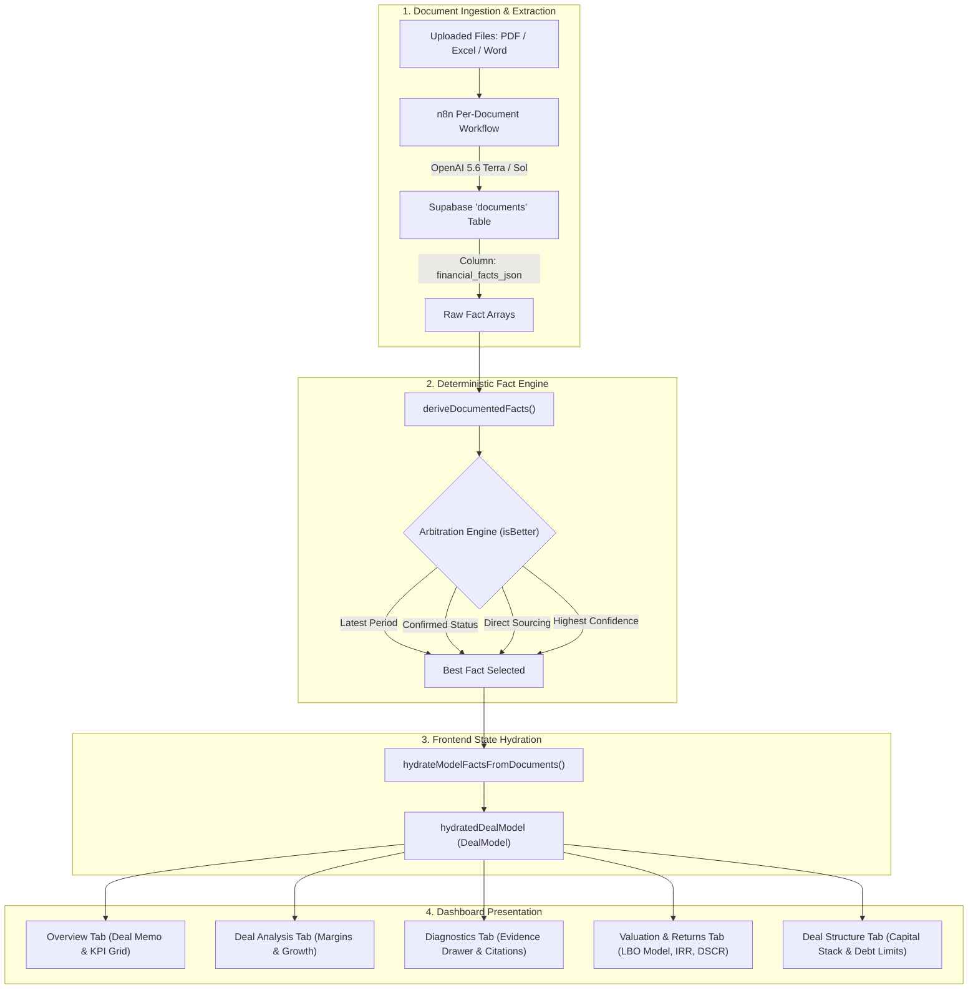

# Documented Facts — Architecture, Reconciliation & Frontend Integration

## 1. Executive Summary

`documentedFacts` is the **deterministic financial truth and evidence engine** of the MergeWorks Due Diligence Dashboard. 

When deal documents (PDFs, Excel workbooks, Word LOIs, P&L statements, Balance Sheets) are uploaded, AI extraction runs on each individual file. `documentedFacts` aggregates, reconciles, and sources those scattered document-level extractions into a single, unified, audit-traceable financial profile for the deal.

It guarantees that:
1. **Numbers are auditable**: Every single financial metric links directly to its source document, page number, or Excel cell, with the exact verbatim excerpt.
2. **Deterministic resolution**: No AI hallucination or arbitrary guessing — conflicting figures across documents are resolved using explicit financial precedence rules (recency, confirmation status, provenance, and confidence).
3. **Frontend synchronization**: Changes to uploaded documents immediately hydrate the entire quantitative underwriting stack (Deal Memo, Valuation, LBO Returns, Diagnostics, Deal Structure).

---

## 2. Architecture & Data Flow



---

## 3. Data Schemas

### Raw Fact (`RawFact`)
Extracted from individual documents by the per-document extraction pipeline:

```typescript
type RawFact = {
    metric: string               // e.g. "revenue", "ebitda_sde", "debt"
    raw_value?: string           // e.g. "$3,420,798", "546K floor"
    normalized_value?: number    // e.g. 3420798, 546000
    period?: string              // e.g. "2025", "TTM", "January through December 2024"
    currency?: string            // e.g. "USD", "$"
    confidence?: number          // e.g. 0.95, 0.99
    status?: string              // e.g. "confirmed", "unconfirmed", "estimated"
    provenance?: string          // e.g. "Extracted from uploaded documents"
    formula?: string             // Optional calculation formula if reconstructed
    citation?: {
        source_file?: string     // e.g. "Werkheiser P&L 2025.pdf"
        page_number?: number     // e.g. 15
        row_or_cell?: string     // e.g. "Income Statement; Total Revenue; 2024"
        excerpt?: string         // e.g. "Total Income $3,420,797.58"
    }
}
```

### Derived Project Fact (`DerivedFact`)
Reconciled project-level metric consumed by dashboard cards:

```typescript
type DerivedFact = {
    value: number                // Clean numeric value for financial math
    status: string               // "confirmed" | "unconfirmed"
    currency: string             // "USD"
    period: string               // Display period (e.g. "2025", "TTM")
    provenance: string           // Description of how the fact was sourced
    confidence: number           // 0.0 to 1.0 confidence score
    citations: Array<{           // Full citation chain
        source_file?: string
        row_or_cell?: string
        excerpt?: string
    }>
}
```

---

## 4. Tracked Metrics Catalog

The quant engine recognizes and indexes the following standardized metrics:

| Metric Key | Definition | Standard Period | Primary Source Document |
| :--- | :--- | :--- | :--- |
| `revenue` | Top-line gross sales / revenue | Annual / TTM | P&L / Income Statement / Tax Return |
| `ebitda_sde` | Operating Cash Flow / SDE / Adj. EBITDA | Annual / TTM | P&L + Add-back schedule / LOI |
| `gross_profit` | Gross profit (Revenue − COGS) | Annual / TTM | Income Statement |
| `cogs` | Cost of Goods Sold / Direct Cost of Sales | Annual / TTM | Income Statement |
| `net_income` | Bottom-line GAAP / Tax net profit | Annual / TTM | Income Statement / 1120S |
| `cash` | Liquid checking, savings, and cash equivalents | Point-in-time | Balance Sheet |
| `total_assets` | Fixed, current, and intangible assets | Point-in-time | Balance Sheet |
| `total_liabilities` | Short-term + Long-term debt & payables | Point-in-time | Balance Sheet |
| `debt` | Existing debt or modeled SBA/Senior debt | Effective Date | Loan pre-qual / Debt schedule |
| `purchase_price` | Enterprise value / agreed transaction price | Deal terms | LOI / Asset Purchase Agreement |
| `asking_price` | Seller's initial asking valuation | Deal terms | Teaser / CIM / LOI |
| `target_working_capital`| Required working capital peg at close | Deal terms | Working Capital analysis |
| `escrow_amount` | Indemnity / escrow holdback amount | Deal terms | LOI / Purchase Agreement |
| `ebitda_multiple` | Implied entry multiple ($\text{Price} / \text{EBITDA}$) | Computed | Valuation Model |
| `revenue_multiple` | Implied revenue multiple ($\text{Price} / \text{Revenue}$) | Computed | Valuation Model |

---

## 5. Conflict Resolution & Arbitration Rules

When multiple documents provide values for the same metric (e.g., Revenue stated across 3 different P&Ls or sales schedules), `deriveDocumentedFacts()` runs deterministic arbitration via `isBetter(candidate, current)`:

```
Candidate Fact vs. Current Best Fact:
  1. Recency: Does candidate have a later fiscal year? (e.g., 2025 > 2024 > 2023)
     └─► YES: Candidate wins.
     └─► NO: Current wins.
     └─► EQUAL: Proceed to step 2.

  2. Confirmation Status: Is candidate "confirmed" while current is not?
     └─► YES: Candidate wins.
     └─► NO: Current wins.
     └─► EQUAL: Proceed to step 3.

  3. Provenance: Is candidate an explicitly stated document line item vs. reconstructed?
     └─► Explicit beats Reconstructed.
     └─► EQUAL: Proceed to step 4.

  4. Model Confidence: Which fact has a higher extraction confidence score?
     └─► Higher confidence wins (e.g., 0.99 > 0.90).
```

---

## 6. How Documented Facts Power the Dashboard Tabs

### 1. Overview Tab (`DealMemoView.tsx` & `DealHealthKPIs.tsx`)
- **KPI Summary Grid**: Reads `revenue`, `ebitda_sde`, `purchase_price` (or `asking_price`), and computes dynamic entry multiple ($\text{Price} / \text{EBITDA}$).
- **Deal Memo Builder**: Automatically formats the formal Deal Memo summary text, complete with EBITDA margins and estimated payback period.

### 2. Deal Analysis Tab (`DealAnalysisWorkspaceView.tsx`)
- Computes Gross Margin $\% = \frac{\text{Gross Profit}}{\text{Revenue}} \times 100$.
- Computes EBITDA Margin $\% = \frac{\text{EBITDA}}{\text{Revenue}} \times 100$.
- Cross-examines stated Net Income against verified EBITDA add-backs.

### 3. Diagnostics Tab & Evidence Drawer (`DiagnosticsWorkspaceView.tsx`)
- Renders the full **Auditable Fact Matrix**.
- Clicking any metric opens the exact source citation drawer with source document name, page/cell location, and verbatim document quote.

### 4. Valuation & Returns Tab (`ValuationWorkspaceView.tsx` & `ReturnsWorkspaceView.tsx`)
- Injects extracted EBITDA into the **5-Year LBO Cash Flow Model**:
  - Senior Debt Capacity ($\text{EBITDA} \times 3.5\text{x}$)
  - Debt Service Coverage Ratio ($\text{DSCR} = \frac{\text{Free Cash Flow}}{\text{Debt Service}}$)
  - Equity IRR and Multiple on Invested Capital ($\text{MOIC}$)
  - Sensitivity analysis across Bear, Base, and Bull exit multiples.

### 5. Deal Structure Tab (`StructureWorkspaceView.tsx`)
- Calculates the true **Cash Required at Close**:
  $$\text{Cash Needed} = \text{Purchase Price} + \text{Target Working Capital} + \text{Fees} - \text{Debt} - \text{Seller Note}$$

---

## 7. Key Utility Files in Codebase

| File Path | Core Function / Responsibility |
| :--- | :--- |
| [`frontend/utils/documentedFacts.ts`](file:///c:/Users/s-bas/MERGEWORKS%20REAL%20WEBSITE/Due-Diligence-Dashboard/frontend/utils/documentedFacts.ts) | `deriveDocumentedFacts()`, `parseMagnitudeMoney()`, `isBetter()`, `periodRank()` |
| [`frontend/utils/diligenceDashboardUtils.ts`](file:///c:/Users/s-bas/MERGEWORKS%20REAL%20WEBSITE/Due-Diligence-Dashboard/frontend/utils/diligenceDashboardUtils.ts) | `hydrateModelFactsFromDocuments()`, `buildReturnsDisplayModel()` |
| [`frontend/utils/financialMetrics.ts`](file:///c:/Users/s-bas/MERGEWORKS%20REAL%20WEBSITE/Due-Diligence-Dashboard/frontend/utils/financialMetrics.ts) | `resolveFinancialMetricsForProject()`, benchmark ground truth fallback map |
| [`frontend/utils/crossDocumentConflicts.ts`](file:///c:/Users/s-bas/MERGEWORKS%20REAL%20WEBSITE/Due-Diligence-Dashboard/frontend/utils/crossDocumentConflicts.ts) | `detectContradictions()`, multi-period variance alerts |
| [`frontend/utils/evidence.ts`](file:///c:/Users/s-bas/MERGEWORKS%20REAL%20WEBSITE/Due-Diligence-Dashboard/frontend/utils/evidence.ts) | `parseDocumentedFacts()`, evidence drawer data formatting |
