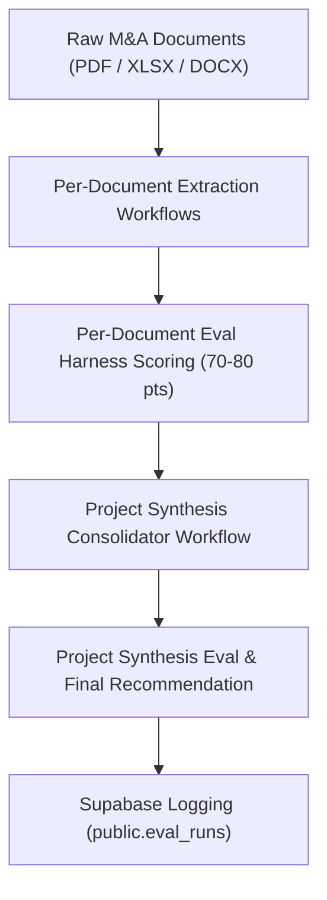

# MergeWorks Evaluation Suite & Harness Guide (`EVALS.md`)

## Overview
The **MergeWorks Evaluation Suite & Harness** is an automated benchmarking framework designed to continuously measure the accuracy, fact extraction quality, risk detection, and deal recommendation fidelity of our AI workflows.

It validates extraction and synthesis outputs against verified ground truth specifications stored in [`test_sets/ground_truth/`](file:///c:/Users/s-bas/MERGEWORKS%20REAL%20WEBSITE/Due-Diligence-Dashboard/test_sets/ground_truth) and logs performance trends over time to Supabase (`public.eval_runs`).

---

## Evaluation Architecture

The framework operates on a **dual-level evaluation model**:



1. **Per-Document Evaluation**:
   Each document in a deal packet is evaluated independently against its matching ground-truth JSON specification (`test_sets/ground_truth/*.json`).
2. **Project-Level Synthesis**:
   After document-level extractions pass, the project synthesis reconciles findings across documents (e.g. customer concentration vs. P&L revenue) and issues the final deal recommendation (**PROCEED**, **RENEGOTIATE**, **ESCALATE**).

---

## 7-Dimension Scoring System (Max 80 Points)

Every document is scored across **7 core dimensions** totaling 80 maximum points, converted to a 0–100% score:

| Dimension | Max Points | Evaluation Criteria |
| :--- | :--- | :--- |
| **1. Classification** | **10 pts** | Matches detected document type (P&L, CIM, Add-Back Notes, Concentration Table, Balance Sheet). Exact match = 10 pts, secondary match = 7 pts. |
| **2. Financial Facts** | **10 pts** | Compares extracted numerical metrics (Revenue, EBITDA, COGS, Net Income) year-over-year. $\le 1\%$ error = 10 pts, $\le 5\%$ error = 5 pts. |
| **3. Risk & Flag Recall** | **20 pts** | Evaluates traffic light accuracy (10 pts) + keyword recall ratio of expected Red & Yellow risk flags (10 pts). |
| **4. Valuation Accuracy** | **15 pts** | Compares calculated valuation base estimate against ground-truth bounds ($\le 15\%$ error = 15 pts, $\le 30\%$ error = 10 pts). |
| **5. Employee Evidence** | **5 pts** | Verifies extracted headcount and payroll evidence against agreements. |
| **6. Math Checks** | **10 pts** | Validates row/column total consistency and accounting balance checks. |
| **7. Acquisition Judgment** | **10 pts** | **New**: Evaluates bottom-line M&A recommendation fidelity (**PROCEED**, **RENEGOTIATE**, **ESCALATE**). Exact match = 10 pts, adjacent risk posture = 5 pts. |

### Partial Credit Scoring Rules
The evaluation harness awards partial credit for near-misses and adjacent risk postures:

- **Classification (10 pts)**:
  - Exact primary document type match: **10 pts (100%)**
  - Secondary/alternative valid document type match: **7 pts (70%)**
  - Wrong classification: **3 pts (30%)**
- **Financial Facts (10 pts per metric)**:
  - Within $\le 1\%$ numerical error: **10 pts (100%)**
  - Within $\le 5\%$ numerical error: **5 pts (50%)**
  - Exceeds $5\%$ numerical error: **3 pts (30%)**
- **Risk Traffic Light (10 pts)**:
  - Exact traffic light match (Red/Yellow/Green): **10 pts (100%)**
  - Off by one risk level: **5 pts (50%)**
- **Valuation Base Estimate (15 pts)**:
  - Within $\le 15\%$ of ground truth: **15 pts (100%)**
  - Within $\le 30\%$ of ground truth: **10 pts (67%)**
  - Exceeds $30\%$ error: **5 pts (33%)**
- **Acquisition Judgment (10 pts)**:
  - Exact recommendation match (`PROCEED` === `PROCEED`, `RENEGOTIATE` === `RENEGOTIATE`, `ESCALATE` === `ESCALATE`): **10 pts (100%)**
  - Risk posture alignment (`YELLOW` $\leftrightarrow$ `RENEGOTIATE`, `RED` $\leftrightarrow$ `ESCALATE`, `GREEN` $\leftrightarrow$ `PROCEED`): **10 pts (100%)**
  - Adjacent risk posture (e.g., `PROCEED_WITH_CAUTION` vs `PROCEED`): **5 pts (50%)**
  - Direct mismatch (e.g., `PROCEED` vs `ESCALATE`): **0 pts (0%)**

### Pass / Fail Benchmark
- **Document Pass Threshold**: **$\ge 70\%$** ($\ge 56 / 80$ points).
- **Suite Pass Threshold**: **$\ge 70\%$** overall average across all test documents (**SHIP-READY**).

---

## Ground Truth JSON Schema

Ground truth specifications are stored in `test_sets/ground_truth/`. Below is an example structure:

```json
{
  "fileName": "Werkheiser_P&L_2024-2025.pdf",
  "business": "Business 1 - Werkheiser Home Maintenance",
  "fileType": "PDF",
  "groundTruth": {
    "documentType": "Profit and Loss Statement",
    "trafficLight": "RED",
    "riskLevel": "HIGH",
    "expectedRecommendation": "ESCALATE",
    "financialFacts": [
      {
        "metric": "revenue",
        "normalizedValue": 3500000.00,
        "period": "Jan-Dec 2025",
        "rawValue": "$3,500,000.00"
      }
    ],
    "expectedRedFlags": [
      "Unexplained wage spike in Salaries & Wages",
      "Missing balance sheet and debt validation schedule"
    ],
    "expectedYellowFlags": [
      "Bank service fees doubled year-over-year"
    ],
    "valuation": {
      "valuation_base_estimate": 2730000
    },
    "employeeEvidence": {
      "employee_count": 14
    },
    "expectedMathCheckStatus": "passed"
  }
}
```

---

## How to Run Evals

### Local Execution
To run the automated evaluation suite locally:

```bash
# Run full evaluation harness
npm run eval

# Or run via tsx directly
npx tsx scripts/run-evals.ts
```

### Unit Testing
To run pure scoring logic unit tests:

```bash
cd frontend
npx vitest run utils/evalScoring.test.ts
```

---

## Supabase Logging & CI/CD Integration

1. **Supabase Table**: Results are automatically published to `public.eval_runs`:
   - Columns: `id`, `run_at`, `commit_sha`, `total_documents`, `passed_documents`, `overall_percentage`, `status`, `report_json`.
2. **CI/CD Regression Gate**: GitHub Actions running `.github/workflows/eval-regression.yml` automatically execute `npx tsx scripts/run-evals.ts` on PRs and commits to enforce that accuracy does not regress below $70\%$.
