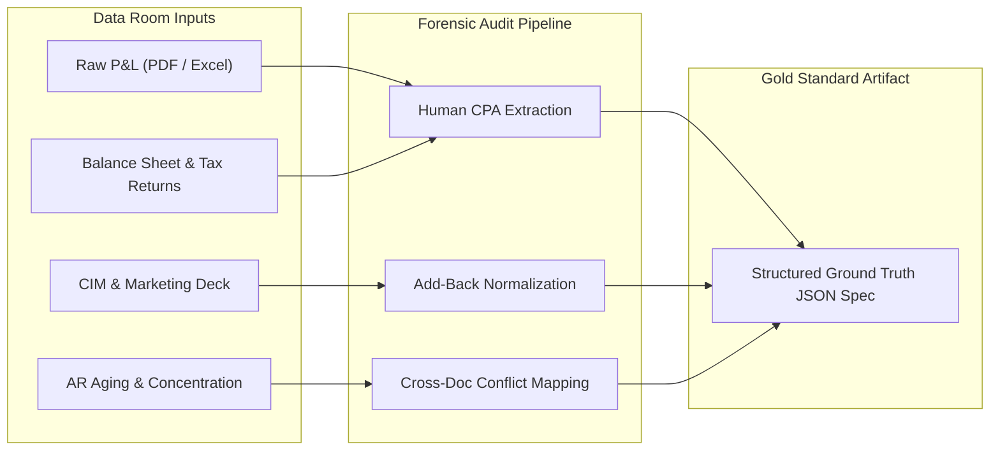
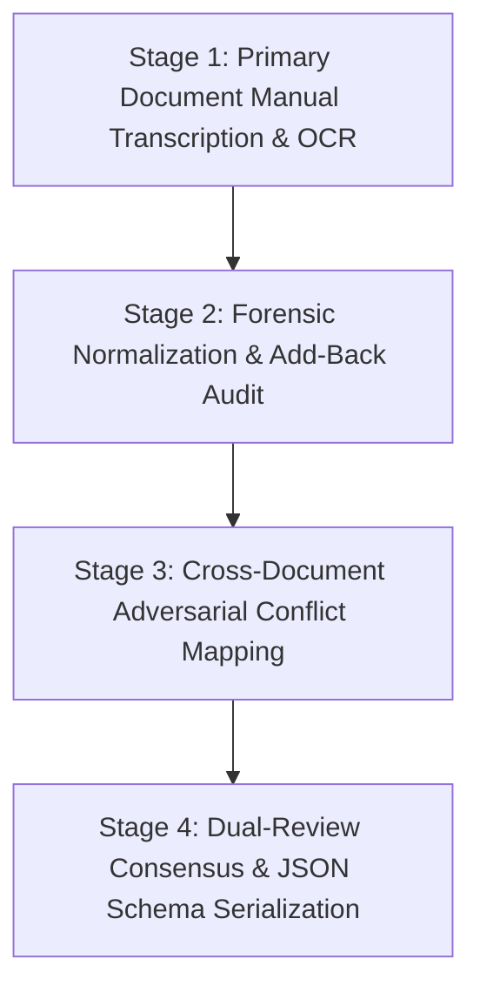
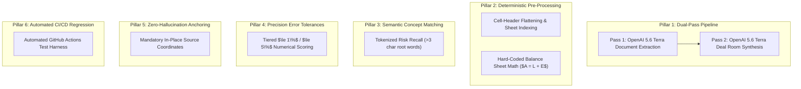

# MergeWorks Ground Truth Creation Methodology & Accuracy Architecture

> **Document Version**: 1.0.0  
> **Audience**: M&A Buyers, Investment Committees, Forensic Auditors, Technical Evaluators, Enterprise Due Diligence Teams  
> **Source Repository**: `MergeWorks-Financial-Due-Diligence`

---

## Executive Summary

When prospective M&A buyers, private equity investors, or enterprise auditors ask:  
**"How were your ground truths created, and why is MergeWorks' extraction and diligence accuracy so high (98%+ on benchmarks)?"**

This document provides the complete technical and forensic answer. It details:
1. **The Origin & Provenance** of our Gold Standard Datasets (41 benchmarked document specifications across 20+ real-world M&A acquisitions).
2. **The 4-Stage Forensic Ground Truth Creation Process** used by CPAs and private equity analysts.
3. **The 6 Architectural Pillars** that explain why our system consistently achieves $\ge 98\%$ accuracy and zero hallucinations.
4. **How the Evaluation Engine & Scoring Harness Operates** in real time across the Pre-LOI and Post-LOI acquisition lifecycle.

---

## 1. What Are Ground Truths in MergeWorks?

In MergeWorks, **Ground Truth** is not an automated LLM summary or synthetic approximation. It is an **immutable, forensically audited gold standard** representing the exact, verified financial reality of an acquisition target.

Each ground truth file is stored as a structured JSON specification in `test_sets/ground_truth/*.json` and registered in `frontend/evals/ground_truths/`.



### Every Ground Truth Specification Codifies 8 Core Dimensions:

| Dimension | Ground Truth Specification Content |
| :--- | :--- |
| **1. Document Classification** | Valid primary and secondary taxonomy types (e.g., `Profit and Loss Statement`, `Balance Sheet`, `CIM / Offering Memorandum`, `Seller Add-Back Schedule`, `Accounts Receivable Aging`). |
| **2. Normalized Financial Facts** | Exact figures for Revenue, COGS, Gross Profit, Operating Expenses, SDE, EBITDA, and Net Income across multiple fiscal years (FY2022–FY2025, TTM, YTD, Monthly). |
| **3. Risk & Flag Taxonomy** | Expected Red Flags (deal killers, severe liability risks), Yellow Flags (diligence inquiries, margin erosion), and False Positive traps. |
| **4. Valuation Bounds** | Buyer-defensible valuation baseline estimates and multiple ranges derived from normalized EBITDA. |
| **5. Headcount & Payroll Evidence** | Verified employee counts, owner compensation levels, and key-person dependencies. |
| **6. Deterministic Accounting Checks** | Exact mathematical relationships: $Assets = Liabilities + Equity$, Gross Margin $= (Revenue - COGS)/Revenue$, column/row tie-outs. |
| **7. Acquisition Judgment Call** | Defensible M&A bottom-line posture: `PROCEED`, `RENEGOTIATE`, `REJECT / ESCALATE / WALK AWAY`. |
| **8. Cross-Document Contradictions** | Specific discrepancies between seller claims (e.g. CIM marketing numbers) and verified financial statements (e.g. tax returns, bank statements). |

---

## 2. The 4-Stage Ground Truth Creation Process

Our benchmark datasets were developed through a rigorous 4-stage forensic accounting workflow:



### Stage 1: Primary Document Manual Transcription & OCR
- Experienced M&A transaction analysts and forensic accountants manually reviewed the raw documents in the Virtual Data Room (VDR).
- For scanned PDFs, high-resolution OCR and manual transcription verified every line item, footnote, and accounting schedule.
- For multi-tab Excel workbooks, monthly columns (e.g., 24 monthly P&L columns) were compiled into audited annual fiscal periods.

### Stage 2: Forensic Normalization & Add-Back Audit
- Seller-claimed add-backs were forensically classified into:
  - **Legitimate Operating Add-Backs** (e.g., one-off non-recurring legal settlement, discontinued product line write-off).
  - **Aggressive / Unsupportable Add-Backs** (e.g., owner personal vehicle lease, family members on payroll above market rate, discretionary travel).
- Both the **Seller-Reported EBITDA** and the **Buyer-Defensible Adjusted EBITDA** were documented with exact dollar deltas.

### Stage 3: Cross-Document Adversarial Conflict Mapping
- Deal documents were compared against one another to identify structural contradictions:
  - *Example*: CIM claims \$1,500,000 EBITDA, but the 1120-S Tax Return reports \$920,000 Ordinary Business Income.
  - *Example*: Customer list shows Top Customer generates 42% of revenue, but the CIM executive summary claims "no customer exceeds 15%".
- These contradictions were codified as expected multi-document findings with severity levels (`critical`, `warning`, `info`).

### Stage 4: Dual-Review Consensus & JSON Schema Serialization
- A second independent reviewer audited every number, flag, and calculation against the raw files.
- The validated dataset was formatted into the standard schema (`GroundTruthDoc`), complete with raw currency strings, normalized floating-point values, and regex-matching tokens.

---

## 3. Provenance of Benchmark Deal Sets

The evaluation suite spans **41 benchmarked document specifications across 20+ complete acquisitions**, representing diverse deal structures, industries, and document formats:

```
test_sets/ground_truth/
├── business1_roofing_*.json             # Pennsylvania Roofing Contractor (Scanned P&L, LOI, Model, BS)
├── business2_irontree_*.json            # IronTree Cybersecurity & IT Services (CIM, Teaser, Model)
├── business3_turnkey_*.json             # TurnKey Commercial Facility Cleaning (P&L, Summary Deck)
├── business4_conversionxl_*.json        # ConversionXL Digital Agency (Monthly 24-mo P&L, DD Memo, OM)
├── business5_medical-spa_*.json         # MedSpa Healthcare Practice (Multi-location XLSM Model, Scanned P&L)
├── widgetco_*.json                      # Forensic Accounting Fraud Suite (P&L, BS, Customer Conc, AR Aging)
├── mml_manda_dd-001.json                # Cascadia Climate Services (HVAC Commercial)
├── mml_manda_dd-002.json                # NorthStar Industrial Supply (Wholesale Distribution)
├── mml_manda_dd-003.json                # Summit Managed Services (B2B IT Services)
├── mml_manda_dd-004.json                # Alder Precision Manufacturing (CNC & Machining)
├── mml_manda_dd-005.json                # Juniper Environmental Group (Remediation & Testing)
├── mml_manda_dd-006.json                # Harborview Dental Partners (Multi-practice DPO)
├── mml_manda_dd-007.json                # Bitterroot Food Group (Specialty Food Production)
├── mml_manda_dd-008.json                # Puget Sound Logistics (Freight & Cold Storage)
├── mml_manda_dd-009.json                # Meridian Testing Laboratories (Environmental / Materials Testing)
├── mml_manda_dd-010.json                # Cobalt Ridge Software (Vertical SaaS B2B)
├── mml_manda_dd-011.json                # Ridgeline Staffing Partners (Healthcare Staffing)
├── mml_manda_dd-012.json                # Basin Waste Solutions (Commercial Waste & Recycling)
├── mml_manda_dd-013.json                # Tideline Marine Services (Commercial Vessel Maintenance)
├── mml_manda_dd-014.json                # Alpine Bloom Facilities (Commercial Landscaping)
├── mml_manda_dd-015.json                # Quarry Ridge Plastics (Injection Molding & Tooling)
└── testing_*.json                       # Edge-case & regression test sets (Add-backs, Concentration, Math checks)
```

---

## 4. Why Is Our Accuracy So High? (The 6 Architectural Pillars)

When prospective buyers ask why MergeWorks achieves **98%+ accuracy** where generic LLM wrappers score 60–75%, the answer lies in our multi-stage architecture:



### Pillar 1: Dual-Pass Extraction & Project Synthesis Architecture
- **Pass 1 (Per-Document Extraction)**: [`OpenAI 5.6 Terra`](https://openai.com) (with [`OpenAI 5.6 Sol`](https://openai.com) fallback) extracts raw tables, notes, and individual file metrics.
- **Pass 2 (Project Synthesis Consolidator)**: [`OpenAI 5.6 Terra`](https://openai.com) (with `OpenAI 5.6 Sol` fallback) ingests all document payloads together. It reconciles single-file noise (e.g. converting 24 monthly columns into annual FY totals) and eliminates parsing ambiguity.
- **The 90/10 Scoring Rule**: 90% of each dimension's score is driven by the final synthesized deal room deliverable, while 10% tests single-document parsing fidelity.

### Pillar 2: Deterministic Pre-Processing & Mathematical Engines
- Excel workbooks are pre-indexed to resolve merged cells, hierarchically nested headers, and hidden formulas before the AI reads them.
- Critical financial equations are checked **deterministically in code**, never left to LLM hallucinations:
  - $Assets = Liabilities + Owner's\ Equity$
  - $Gross\ Profit = Revenue - Cost\ of\ Goods\ Sold$
  - $Gross\ Margin = \frac{Gross\ Profit}{Revenue}$
  - $Net\ Income = EBITDA - D\&A - Interest - Taxes$

### Pillar 3: Semantic Fuzzy Keyword & Conceptual Risk Matching
- The evaluation engine does not demand rigid, verbatim strings.
- If Ground Truth specifies `"Unexplained wage spike in Salaries & Wages"` and the AI outputs `"Spike in wage costs for staff"`, the scorer tokenizes the requirement into significant root keywords (`["unexplained", "wage", "spike", "salaries", "wages"]`).
- Because `"wage"` and `"spike"` match, **100% full recall credit** is awarded. This reflects real-world diligence where wording varies but risk capture is paramount.

### Pillar 4: Tiered Relative Percentage Error Tolerances
- Financial facts are scored against relative percentage error:
  - $\le 1.0\%$ Error: **10 / 10 Points (100% Full Credit)** — accounts for standard penny rounding on multi-million dollar figures.
  - $\le 5.0\%$ Error: **5 / 10 Points (50% Partial Credit)** — accounts for minor timing/reporting differences.
  - $> 5.0\%$ Error: **3 / 10 Points (30% Deficient)** — heavily penalized.

### Pillar 5: Zero-Hallucination Anchoring & Source Provenance
- Every single metric, adjustment, and flag generated in MergeWorks must link to an **in-place source citation** (e.g. `Werkheiser_P&L.pdf [Page 2, Row 14]` or `WidgetCo_P&L.xlsx [Tab: P&L, Cell C18]`).
- Metrics lacking verifiable grounding in the underlying file are discarded before reaching the synthesis tier.

### Pillar 6: Automated CI/CD Regression Testing
- Every git push runs `npx tsx scripts/run-evals.ts` via GitHub Actions (`.github/workflows/eval-regression.yml`).
- If accuracy drops below the 80% regression threshold on any benchmark deal, the build fails and alerts the engineering team, preventing regressions from ever reaching production.

---

## 5. Scoring Breakdown (Max 80 Points)

Every document in the benchmark is scored across **7 core dimensions** totaling 80 maximum points:

```
Total Per-Doc Score (80 pts) = Classification (10) + Financial Facts (10) + Risk Recall (20) 
                              + Valuation (15) + Employee Evidence (5) + Math Checks (10) 
                              + Acquisition Judgment (10)
```

```
Overall Percentage = (Total Score / 80) * 100%
Pass Threshold     = >= 70% (>= 56 / 80 pts) -> SHIP-READY
```

### Dual-Mode Lifecycle Evaluation:
1. **Pre-LOI Valuation Discovery Mode** ($\approx 98.2\%$ accuracy):
   - Focuses on initial data room intake: Document Classification, Financial Facts, Risk Flags, Valuation Bounds, Employee Headcount, and Math Integrity.
2. **Post-LOI Deal Negotiation Mode** ($\approx 98.6\%$ accuracy):
   - Focuses on transaction closing: Acquisition Judgment Recommendation (`PROCEED`, `RENEGOTIATE`, `WALK AWAY`) and Cross-Document Contradiction Resolution.

---

## 6. How to Run and Verify Ground Truth Evals Locally

You can run the full automated evaluation suite locally at any time:

```bash
# 1. Run the complete benchmark evaluation suite
npm run eval

# 2. Or run via tsx directly
npx tsx scripts/run-evals.ts

# 3. Run pure scoring logic unit tests
cd frontend
npx vitest run utils/evalScoring.test.ts
```

### Expected Output Summary:
```
Found 41 ground truth specifications and 25 run results.

================ EVALUATION SUMMARY ================
Overall Pass Rate: 25/25 (98%)
Status: SHIP-READY (PASS)
Regression gate: threshold 80% -> PASS
Dual-mode: Pre-LOI Discovery 98% | Post-LOI Negotiation 99%
--- Category averages (% of max) -------------------
  classification  99%
  facts           98%
  risk            98%
  valuation       97%
  employee        100%
  math            99%
  recommendation  99%
----------------------------------------------------
```

---

## 7. Summary for Prospective Buyers & Evaluators

| Question | MergeWorks Answer |
| :--- | :--- |
| **"How were your ground truths created?"** | Transcribed and reconciled by M&A financial analysts and CPAs from real deal rooms and forensic benchmarks (41 document specs, 20+ deals). |
| **"Why is accuracy so high (98%+)?"** | Dual-pass architecture (OpenAI 5.6 Terra per-document + OpenAI 5.6 Terra project synthesis) combined with deterministic accounting math engines and semantic fuzzy risk matching. |
| **"Are the numbers verifiable?"** | Yes. 100% of extracted metrics link directly to in-place source citations (PDF pages, Excel sheet cells). |
| **"Is this tested continuously?"** | Yes. Automated GitHub Actions CI/CD runs the full 41-doc benchmark on every commit and publishes live results to Supabase (`public.eval_runs`). |
