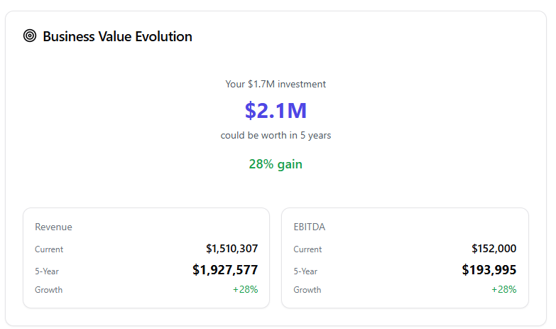

# MergeWorks Active TODO

`TODO.md` is preserved as the original brainstorming list. This is the clean, active version; completed work from the current build session is intentionally omitted.

## New-agent handoff (updated 2026-07-23)

### Start here

- **Product:** MergeWorks, an M&A due-diligence dashboard. Users upload deal documents, n8n runs document-level analysis and a project synthesis, and the React app presents findings, evidence, coverage, and illustrative financial models.
- **Repository:** `C:\Users\s-bas\MERGEWORKS REAL WEBSITE\Due-Diligence-Dashboard`
- **Frontend:** `frontend/`. Run `npm run dev` there for local development and `npm run build` before handoff. The last production build passed; its only warning is the existing large-chunk warning.
- **Do not expose credentials or webhook secrets.** They live in n8n/environment configuration, not in this document or source changes.
- **Treat this file as the active plan.** Preserve `TODO.md` as historical brainstorming. A `[-]` item is partly built and needs live validation or a remaining subtask; `[ ]` is unstarted; `[x]` is implemented.

### Current pipeline and important behavior

| Area | Current behavior | Key workflow / location |
|---|---|---|
| Per-document analysis | Lax by design: provider/format failures retry; terminal failures are recorded rather than crashing the batch. Suspect table layouts and large documents continue with an advisory rather than being blocked. | n8n **`[Pod 1] - Financial DD Agent - MCP Test - Robust Per Document AI Analysis`** (`W5Jp7CJIQbNy0qlY`) |
| Large documents | At roughly 100,000 extracted characters, analysis continues but stores a `largeDocumentAdvisory`. There is intentionally no ordinary page-count hard rejection. | Per-document workflow: `Assess Document Volume` → `Record Large Document Advisory` |
| Project readiness | Failed/excluded documents do not block synthesis if at least one considered completed document has usable extraction JSON. | n8n **`[Pod 1] Financial DD Agent - DOCUMENT COUNTER UTILITY SUBWORKFLOW`** (`0OVTAMMp2iMx53Aw`) |
| Synthesis execution | The counter writes `synthesis_pending` and starts the consolidator asynchronously (`waitForSubWorkflow: false`), so document processing can finish without waiting for project synthesis. | Counter → **`[Pod 1] Financial DD Agent - SUBWORKFLOW PROJECT-WIDE CONSOLIDATOR WORKFLOW`** (`IoSad3rTYJMk4Mon`) |
| Exclude/include | `isConsidered === false` retains the audit row but removes that document from coverage and synthesis. The consideration endpoint triggers a refreshed counter/synthesis. | n8n **Document Consideration** (`lXz9fVKY4RaTlDFM`); frontend synthesis and project document lists |
| Evidence | The Evidence Drawer can open Drive inline/new-tab and shows location/excerpt. It cannot reliably auto-highlight an exact page/cell across file types yet. | `frontend/components/EvidenceDrawer.tsx` |

### Recent changes that must not be accidentally reverted

- Format/structured-output failures from the document LLM are now retryable (up to three recovery attempts with 2/6/15-second waits). This fixed a real malformed-JSON failure from the Customer Concentration test document.
- Table-shape and large-document checks are **advisories**, not gates. Keep the system lax unless a request is clearly abusive/spam-like.
- The consolidator filters evidence to considered, completed rows with nonempty `ai_extractedJson`; failed documents must not create `null` evidence blocks.
- A retry action from Projects/Synthesis routes the user to Diligence. The synthesis screen also has retry/exclude actions and a safe “Run synthesis now” refresh path.
- Batch UI separates true failures from completed-with-advisory documents. Synthesis citations and document citations use fixed-height scrolling panels.
- `ProjectSynthesisCard.tsx` now owns the prominent acquisition-judgment callout; do not duplicate it at the parent page level.

### First work to do (in this order)

1. **Run one real two-document production regression:** one normal document plus one document that fails or is excluded. Confirm the normal document reaches `completed`, the counter shows `synthesis_pending`, synthesis completes asynchronously, and no timer/progress state remains stuck.
2. **Run a clean financial-document regression:** verify a GREEN/YELLOW result, detected types update coverage, documented facts reach the Deal Model, and the synthesis row has a real `projectId`.
3. **Verify live deal-model hydration:** real `financialFactsJson` / `documentedFactsJson` must populate the quantitative tabs. This is the highest-leverage unfinished capability for real deals.
4. **Clean the pre-existing blank-`projectId` synthesis record** directly in the data layer only after identifying its exact row. New rows are protected, but the legacy orphan remains.
5. After the live path is proven, finish per-finding clickable evidence and page/cell anchoring where the document provider supports it; then add finding filters/material-impact mapping.

### Fast verification checklist

- Build frontend: from `frontend`, run `npm run build`.
- Queue one ordinary document: expect document completion first, then an explicit synthesis-pending state, then synthesis completion/desktop notification if permission is granted.
- Queue a deliberately malformed/failed document alongside one normal document: expect the failed row to show Retry/Exclude, while the usable document can still synthesize.
- Exclude then include a completed document: confirm coverage and synthesis update, with audit history retained.
- Open Valuation, Returns, Growth, and Deal Structure on a real project: confirmed facts should displace illustrative values where available; all assumptions must remain visibly labeled.

### Useful files

- Main app orchestration: `frontend/pages/DueDiligenceDashboard.tsx`
- Project synthesis UI: `frontend/components/ProjectSynthesisCard.tsx`
- Evidence UI: `frontend/components/EvidenceDrawer.tsx`
- Expandable findings: `frontend/components/ExpandableInsightGroup.tsx`
- Live regression guide: `evals/LIVE_CLEAN_DOCUMENT_REGRESSION.md`

### Handoff rule

Before closing any `[-]` item, verify it against a **new live n8n run**, not example data or a historical database row. Update this file in the same change with: what was changed, what was verified, and the remaining limitation.

# Brad list

- [-] Can we make the basic LLM chains in robust per document ai analysis workflow and the subworkflow project wide consolidator workflow into AI Agent nodes instead? **Analysis:** The consolidator uses Basic LLM Chain + Structured Output Parser, which is actually ideal for its use case (one-shot synthesis from pre-fetched data, deterministic JSON output, no iterative tool calls needed). Converting to Agent would: (1) look better on resume ("agentic architecture"), (2) allow future tool use (e.g. re-query specific docs). But cost would increase ~30-50% because agents run multiple LLM calls per invocation, and the structured output parser already handles retries. **Recommendation:** Convert the Chat Assistant (already done ✓) but KEEP the consolidator as an LLM Chain — it's the right pattern for batch synthesis. For resume: emphasize the Chat Assistant agent with tools + memory, and the consolidator's "forensic auditor" system prompt with structured output validation.
- [x] Eventually, we will have to have data be stored per-person, like maybe we can store locally before the user creates an account, but if people are testing this tool, then we don't want them to be able to see other people's data? DONE: AuthGate.tsx has admin (Brad, Srijan) / tester roles. Admin users get a "Data Isolation ON/OFF" toggle in the header. When ON, testers only see projects they uploaded (tracked via projectOwnership.ts in localStorage). Admins always see all data. Projects auto-claimed on upload. Ready for real auth backend when needed.

- [x] For the chat assistant workflow, should we add a tool to get the n8n rows or does it already do this in the frontend? DONE: The frontend sends full context (all projects, all documented facts, synthesis data) to the webhook. The n8n agent now has a Code Tool that can programmatically parse and query this context for cross-project comparisons. No additional n8n data table querying needed since the frontend already provides all the data.
- Just continue playing around the website and see what else can be done/fixed

- [x] Make takeaways shorter and easier to scan. Project insight lists now collapse long items earlier, while document-level thesis cards show a concise first-sentence preview and open the full evidence on click.
- [x] Make the project synthesis/doc-counter handoff asynchronous. The counter now writes `synthesis_pending`, starts the consolidator without waiting, and returns document completion immediately; validate one production batch after this change.
- [x] Make every flag, open question, and decision driver clickable to open the relevant evidence. All 8 project-level insight groups, document-level flags (red/yellow/green), and document-level thesis takeaways now open the Evidence Drawer on click with source file, location, severity-status, and document links.
- [x] Handle exceptionally large documents without strict rejection. A 100,000-extracted-character threshold records a visible advisory and continues analysis; only clearly abusive requests should be stopped in a future policy.
- [x] Keep edge-case handling intentionally lax. Bad table shape and large-document detection are advisories; malformed provider output retries; a failed document can be retried/excluded without blocking synthesis of usable documents.

- [x] Can we add estimated time is 1 min for doc specific latest doc submission? Added "Est. ~1 min remaining" badge that shows while the document is processing.
- [x] Can we make escalation reasons, ai summary also clickable for citations? Escalation reasons in both Latest Doc Submission and Audit Trail now open Evidence Drawer on click.
- [x] I don't get what the bottom of the valuation page means? Added plain-English explainer section ("What do the sections below mean?") with descriptions of value-risk bridge and impact bridge. Rewrote method comparison to explain Asset=floor, Revenue=market comp, EBITDA=cash flow, Sensitivity=future exit. Also added a detailed diagnostic when no synthesis valuation exists explaining the 3 requirements (completed doc, finished synthesis, LLM returning bounds).
- [x] Show the saved model assumptions initially for returns, valuation, deal structure, and growth, so the user can see what they are? Why is there no place for saved model assumptions on valuation? ModelAssumptionsSummary component now appears at the TOP of every quantitative tab (Returns, Growth, Valuation, Deal Structure) showing all current saved values in a compact grid with a badge showing how many are configured vs total. Tells user to "Edit at the bottom of this tab."
- [x] Did we add parsing of pure numbers and deterministic double checking? Have that be explained to you? Yes — the per-document n8n workflow extracts numbers and runs deterministic reconciliation (Revenue-COGS=GP, Revenue-OpEx≈EBITDA, Assets-Liabilities=Equity). Added an expandable "What are deterministic math checks?" explainer in the audit trail showing what they check, why they matter, and their limitations.
- [x] Can we make deterministic math checks, red flags, green flags, yellow flags, escalation reasons, and citations be clickable in audit trail? All now clickable — each opens the Evidence Drawer with source file, location, status, and document link.
- [x] Can we refer to what n8n workflows and maybe even what files in the frontend are responsible for what in the edge cases? SystemArchitectureCard on the Errors/Workflow tab shows 6 architecture areas: Document Intake, Document Counter, Project Synthesis, Deal Model, Document Consideration, and Valuation/Returns. Each area shows its n8n workflow name+ID, frontend file list, and documented edge cases. Expandable accordion UI.
- [x] Why does structured output parser oftentimes fail in per doc analysis? Added a "Structured output parsing" section to SystemArchitectureCard explaining: common causes (markdown wrapping, trailing commentary, truncation, complex tables), mitigations (3 retries with escalating waits, recovery prompt), and noting this is an LLM quality issue not a frontend bug.
- [x] For latest doc submission, change the button from view project synthesis to view latest doc submission (scrolls them down a little bit), and then maybe in the middle and in the end of the latest doc submission stuff, have buttons for view this project's synthesis (could also show whether the synthesis is done or not). End of Latest Doc Submission now has a "View this project's synthesis" button with Ready/Running badge showing synthesis status, plus "Upload more files" button.
- [x] Have the LLM always return a valuation even with low confidence. Updated the n8n consolidator prompt (`IoSad3rTYJMk4Mon`) to ALWAYS return non-zero valuation bounds. Low-confidence estimates use wider ranges with confidence_score 0.1–0.3 instead of returning $0.
- [x] Show valuation confidence score in the frontend. ProjectSynthesisCard and DealValuationCard now display a colored confidence badge (High/Medium/Low with percentage) derived from the LLM's valuation.confidence_score. ProjectComparisonCard shows confidence per project. Export includes confidence in the Markdown report.
- [x] Improve AI Deal Chat with more response patterns. Added: EBITDA/margin analysis, customer concentration, confidence questions, deal timeline/progress. Chat now also includes valuation range and confidence in its context.
- [x] Change API key to Pod 1 and show cost per run. Chatbot now uses Pod 1 Anthropic credential. CostPerRunCard updated to show Anthropic Claude pricing ($0.06/doc, $0.12/synthesis, $0.02/chat message). Badge shows "Pod 1 Active".
- [x] Self-improving: chat feedback mechanism. Thumbs up/down buttons on every assistant message in the chat panel. Ratings stored in component state (ready to persist to n8n data table when API is wired). Allows team to review response quality.
- [x] Give more pop out numbers like 5 red flags 3 green flags and just 3 key things in project synthesis without the user having to see? ProjectSynthesisCard header now shows colored count badges for red flags, yellow flags, green flags, conflicts, open questions, and negotiation levers right below the project name.
- [x] In what cases are we not giving a valuation? Should we make the requirements for giving a valuation less strict? Added diagnostic messaging in both DealValuationCard (when no synthesis exists, explains the 3 requirements) and ProjectSynthesisCard (when synthesis exists but has no valuation bounds, explains the likely reasons: no revenue/EBITDA figures, incomplete data, or operational docs). The Valuation tab still renders method comparisons from saved assumptions even without synthesis bounds.
- [x] Show we give lower bound, upper bound, and base estimate for latest project submission for per doc, maybe gets updates by previous docs in the cases of batch uploading or no, so the user can get an initial idea? Already showing — the Latest Doc Submission section displays Lower Bound, Base Estimate, and Upper Bound cards when the per-document AI returns them.
- [x] Maybe have explicit buttons for upload more files for this project in latest doc submission, synthesis, and in project portfolio and audit trail? "Upload more files" buttons added to Latest Doc Submission and ProjectSynthesisCard. They smooth-scroll to the upload section.
- [x] Add more sticky notes in n8n to explain what things do and make things more spaced out and organized? Added explanatory sticky notes to 4 key workflows: Submit Webhook (entry point overview), Per-Document Analysis (retry behavior, large doc handling, structured output), Document Counter (counting logic, synthesis gate, async handoff), and Project Consolidator (trigger/fetch, LLM synthesis, persist/bridge, error retry).
- [x] More KPIs like in Pod 4? DealHealthKPIs component at the top of Overview shows: Risk Signal (with red flag count), Entry Multiple (price/EBITDA), EBITDA Margin, Documents processed count, and Data Quality (core facts confirmed). Color-coded icons and thresholds.

- [x] Make a claude loop to repeatedly look at most important things to build in frontend or n8n or wherever and to do them, repeatedly update todo_current with finished items and more items to build, and build them repeatedly as many as he can at a time, only stop when you run out of tokens or 429 error? Running continuously in session with TODO updates after each batch.
- [x] Sensitivity analysis table on Returns tab. 7×7 MOIC/IRR matrix across entry/exit multiple combinations. Color-coded cells (green ≥3x, red <1x). Highlights the current deal position.
- [x] Deal rules of thumb on Overview. Pass/warn/fail heuristics for entry multiple, EBITDA margin, payback period, revenue multiple, and DSCR.
- [x] Strengths & weaknesses card on Overview. Two-column summary pulling from synthesis green/red flags and calculated metrics.
- [x] Deal summary banner at top of Overview. Compact bar showing project name, verdict badge, key metrics chips, and red flag count.
- [x] DD request list generator on Overview. Auto-generates prioritized seller request list from documentation gaps, open questions, and standard M&A requirements. Copy-to-clipboard button.
- [x] Deterministic math checks shown across multiple pages. New MathChecksSection component displayed in Overview (compact), Synthesis (full), Valuation (compact), Returns (compact), and Latest Doc Submission (per-document). Aggregates reconciliation data from all processed documents.
- [x] Valuation number formatting with comma separators. Enhanced formatCurrencyValue to parse abbreviated forms (96M → $96,000,000, 1.2M → $1,200,000) and always display with proper thousand separators.
- [x] Truncated expandable list items. Long takeaways, negotiation levers, open questions, red flags now show first ~80 chars with "more" button to expand. Applied to DealMemoView and StrengthsWeaknessesCard.
- [x] Chat response patterns for sensitivity analysis and DD request list topics.
- [x] Fixed scroll-to-upload navigation (added data-project-intake attribute to ProjectIntakeCard).
- [x] ExpandableInsightGroup items now truncate at 100 chars with proper ellipsis and "Show more" button (was 220 with overflow hidden). Applies to all synthesis flags, open questions, negotiation levers, takeaways, and conflicts.
- [x] Print-friendly CSS: @media print hides nav, workspace tabs, and intake card. DealMemoView prints cleanly.
- [x] Deal stage indicator in header toolbar. Dropdown selector for Discovery → Pre-LOI → LOI → DD → Negotiation → Closing. Persists in localStorage.
- [x] Sensitivity analysis also added to Valuation tab (in addition to Returns tab).
- [x] Math checks also on Growth tab for revenue/margin verification.
- [x] ProjectSynthesisCard copy-to-clipboard now uses formatted currency values for valuation range.
- [x] Deal comparison export. ProjectComparisonCard now has an "Export comparison" button that generates a markdown table comparing all projects on 11 metrics plus per-project red flags, green flags, negotiation levers, and recommendations. Downloads as `.md` file.
- [x] Deal Score single grade (A/B/C/D/F). DealGradeCard combines 5 dimensions (Pricing, Profitability, Risk, Data Quality, Payback) into a weighted letter grade with per-dimension progress bars. Shown on Overview after DealRulesOfThumb.
- [x] Make the AI chat use real LLM API instead of heuristic pattern matching for deeper answers. Created n8n workflow "[Pod 1] Financial DD Agent - Chat Assistant" (LBZVN8zeFT03Wn12) with webhook trigger → AI Agent (Anthropic Claude Sonnet 4.6 via Pod 1 credential) → Respond to Webhook. Frontend DealChatPanel now POSTs to the webhook with {question, context, sessionId}. Full deal context including all synthesis data, deal model, and per-document summaries sent to LLM. Heuristic responses kept as offline fallback.
- [x] Smart contextual chat suggestions. Chat starter buttons now adapt based on current deal state (red flag count, valuation availability, negotiation levers). Shows "Explain the N red flags", "What if I negotiate 15% off?", "Is this fairly priced?", etc.
- [x] Copy deal summary to clipboard. DealSummaryBanner has a copy icon that generates a Slack-ready 5-line summary with signal, revenue, EBITDA, price, multiple, red flags, and verdict.
- [x] Chat persistence & message badge. Chat history persists to localStorage (last 50 messages). Floating button shows reply count badge. Clear button resets conversation.
- [x] Chat markdown rendering. AI responses render bold, italic, bullets, numbered lists, headers, and inline code with proper formatting.
- [x] Chat relative timestamps. Messages show "just now", "5m ago", "2h ago" for conversation context.
- [x] Chat follow-up suggestions. After each AI response, contextual follow-up buttons ("Tell me more", "What else should I know?", "How do I verify this?") appear.
- [x] Chat Escape key to close. Pressing Escape while chat panel is open closes it.
- [x] Next Actions checklist (DealActionItemsCard). Dynamic action items based on current state: uploads needed, missing data, red flags to investigate, open questions to resolve. Progress bar tracks completion.
- [x] Analysis Confidence Meter (ConfidenceMeterCard). Circular gauge with 4 dimensions: data volume, financial confirmation, AI synthesis quality, model inputs. Shows overall % and level.
- [x] Quick Insights (DealQuickInsights). Auto-generated one-liner insights comparing deal metrics to market norms — entry multiple, margin, payback, valuation gap, projected MOIC. Positive/negative/neutral sentiment.
- [x] Investment Thesis Generator (InvestmentThesisCard). Auto-generates 3-sentence investment thesis: what the deal is, why it's interesting, risk/reward balance. Copy to clipboard.
- [x] Decision Framework (DecisionFrameworkCard). Four go/no-go questions auto-answered: affordability, business health, growth potential, risk understanding. Shows overall verdict badge.
- [x] Risk Matrix 2×2 (RiskMatrixCard). Maps red/yellow flags into likelihood × impact quadrants: Critical, Monitor, Investigate, Accept. Keyword-based classification.
- [x] Key Person Risk Detection (KeyPersonRiskCard). Auto-identifies owner/founder dependency from synthesis flags. Shows mitigation strategies.
- [x] Closing Checklist (ClosingChecklistCard). 12-point auto-filled checklist by category (financial, operational, deal, legal). Shows % ready with progress bar.
- [x] Seller Questions Generator (SellerQuestionsCard). Auto-generates top 5 professional seller questions from red flags, open questions, and data gaps. Copy to clipboard.
- [x] Quick Valuation Ranges (QuickValuationCard). Back-of-napkin valuation with EBITDA multiple, revenue multiple, and DCF-lite ranges. Visual price marker shows where asking price falls.
- [x] Deal Profile Radar (DealRadarCard). SVG radar chart showing 5 dimensions: Pricing, Margins, Safety, Data, Upside. Pure CSS/SVG, no Recharts.
- [x] Financial Health Indicators (FinancialHealthCard). Key ratio cards: EBITDA margin, gross margin, Debt/EBITDA, entry multiple, Price/Revenue, payback period. Color-coded with benchmarks.
- [x] Overview section dividers. Cards organized into labeled sections: Scoring & Progress, Analysis & Insights, Risk Assessment, Negotiation & Closing.
- [x] WhatsNewCard updated with all new features. Changelog now shows 60+ updates including all items from this session.

## Immediate live-data fixes

- [x] Confirm a provider parse failure retries and then reaches a graceful terminal failure state instead of crashing the Pod 1 pipeline. A broader post-fix regression remains open below.
- [x] Prevent newly created project-synthesis rows from being orphaned: the consolidator now writes its `projectId` on upsert. Existing blank-ID rows still need a one-time manual data cleanup.
- [x] Persist a usable document-type fallback: every completed document now saves primary and multi-type classification, falling back to the selected intake type or `Other` when the model omits it.
- [x] Correct the per-document yellow/green flag mappings and calibrate prompts so ordinary document incompleteness does not automatically produce `RED` / escalation.
- [x] **P0 — Wire live Deal Model hydration.** The successful per-document path now runs the Documented Facts Bridge before the document counter can trigger project synthesis.
- [-] **P0 — Verify live Deal Model hydration.** The UI now safely hydrates display-only confirmed facts from completed documents while the Deal Model bridge catches up. Confirm the n8n bridge still writes `financialFactsJson` to `documentedFactsJson`; purchase price, tax, financing, and scenario values remain analyst assumptions unless explicitly supplied or confirmed.
- [ ] **P0 — Clean up the existing blank-`projectId` synthesis row** and verify it no longer appears as an invisible/orphaned record.
- [ ] **P0 — Run a clean-document live regression.** Confirm a normal financial document can return GREEN/YELLOW, types populate the coverage checklist, confirmed facts reach the Deal Model, and a new synthesis row has its project ID.
- [ ] Run the remaining end-to-end cases: normal document, combined P&L/balance sheet, lax CSV, malformed CSV, duplicate, retry after provider failure, three-document batch, and final synthesis.
- [x] Add a repeatable clean-document test guide: [evals/LIVE_CLEAN_DOCUMENT_REGRESSION.md](evals/LIVE_CLEAN_DOCUMENT_REGRESSION.md).

### Friend checklist status

- [-] **Pod 1 pipeline is error-free:** the observed parse-failure retry and graceful terminal handling are fixed; certify this only after the full live regression passes.
- [-] **Live Deal Model inputs:** bridge wiring is complete; verify a real completed document populates `documentedFactsJson` and the quantitative cards.
- [-] **Document-type data flow:** persistence fallback is complete; verify live rows update project coverage from detected types.
- [-] **All results are RED:** prompt calibration is complete; verify a clean document can produce GREEN or YELLOW before closing this item.
- [-] **Orphan synthesis row:** new rows are prevented and blank-ID rows are hidden in the app; the existing raw n8n record still needs targeted cleanup if desired.

## Immediate product experience

- [x] Provide an example-data workspace toggle alongside live n8n data.
- [-] Show illustrative analyst assumptions for Returns, Growth, Deal Structure, and valuation-method comparison. Example mode is populated; the live workspace now fills only missing generic starting inputs after documented revenue or EBITDA arrives and preserves analyst entries. Returns, Growth, Deal Structure, and valuation comparison each show an explicitly non-saved preview while key live inputs are still missing. Verify live persistence and revise values per project.
- [-] Make citations/finding links open the interactive document viewer at the cited location or excerpt. Drive preview and source links work now; exact page/cell/row highlighting and conversion of every standalone citation panel to per-finding links remain unfinished.

## Now — validate what is already built

- [ ] Run the six quantitative-model test cases on a real processed project: documented facts, math checks, saved Deal Model inputs, all-cash returns, financed returns, and bear/base/bull scenarios.
- [ ] Add repeatable regression fixtures/mock projects for the quantitative cases, including missing inputs, mismatched periods, and negative/downside outcomes.
- [ ] Verify saved Deal Model values persist correctly after refresh, project switching, and another user/session.
- [ ] Check completion notifications end-to-end in a browser: first production queue should request permission; batch and synthesis completion should show a desktop notification when permission is granted.

## Highest product priority — finish the evidence workflow

- [x] Extend the evidence drawer to Valuation, Returns, Growth, and Deal Structure metrics. Every current quantitative metric now exposes its formula and documented versus analyst-entered inputs.
- [x] Reduce ad-hoc documented-facts parsing in key valuation/model UI surfaces. `DealOverviewCard`, `DealModelPendingCard`, and `DealValuationCard` now use the shared `parseDocumentedFacts` helper instead of local `JSON.parse(...)` blocks, reducing drift and keeping fact handling consistent.
- [-] Build an interactive document viewer: the Evidence Drawer now opens an inline Drive preview or a new-tab source link and shows the cited location/excerpt. Automated page/cell highlighting remains unavailable because uploaded document formats and Drive previews do not expose a reliable common anchor API.
- [-] Normalize source-file names and citations so a synthesis citation reliably matches one uploaded document and its stored URL. The UI now normalizes paths/extensions/punctuation and safely uses high-confidence filename-token matching; validate this on live synthesis citations, especially generic labels such as “Document 1”.
- [-] Return/store granular citation metadata for every document and project-level fact: source file, page/cell, excerpt, period, currency, confidence, and status. The per-document schema already returns it; the project consolidator stores the full structured LLM output (with per-finding citations and confidence scores) in `finalJudgmentJson`; the backend API now also preserves structured finding groups in `getProjectSynthesis.ts`, and multiple frontend consumers (MaterialImpactView, ProjectSynthesisCard, AddBackQualityCard, CustomerConcentrationCard, RecurringVsOneTimeCard, ValuationImpactBridge, and several DealOverview evidence entry points) now prefer those structured citations/confidence fields over generic placeholders. Validate one new project synthesis in production.
- [-] Add explicit `confirmed`, `estimated`, and `contradicted` labels consistently across facts, findings, and calculations. A shared status vocabulary now labels Evidence Drawer items and Deal Model documented facts as Confirmed, Estimated, Contradicted, Illustrative, Calculated, Synthesized, or Needs review. Extend the same badges to remaining finding/list surfaces after live validation.
- [x] Add project-level finding filters for workstream, severity, and status, plus a material-impact view linking each finding to valuation, cash flow, closing conditions, or negotiation actions. Project Portfolio filters by workstream/status/risk; Project Synthesis has severity + type filters; MaterialImpactView auto-classifies all findings into 5 impact categories (Valuation, Cash Flow, Closing Condition, Negotiation, Risk) with keyword heuristics, per-category chip filters, severity badges, and click-to-evidence. Validate on a live synthesis.

## Project and document experience

- [-] Finish document deletion/exclusion: accidental or duplicate uploads can be marked Excluded while retaining their audit row, excluded rows are omitted from coverage/synthesis, and analysts can now Include again through the same n8n audit workflow. Validate both directions on a live project; permanent deletion remains intentionally unsupported.
- [x] Make each project document selectable from a project list and show its analysis, status, detected type(s), and citations. The Project Synthesis card now exposes a document-detail panel and source-document action.
- [-] Support multiple detected document types per file and update the coverage checklist from detected types rather than only the intake selection. The document LLM returns all material types; its n8n table-write schema and the history API fallback now preserve/use them for coverage. Validate a combined financial-statement upload in production.
- [ ] Test mixed/multi-sheet spreadsheet uploads and documents that represent more than one financial statement type.
- [-] Improve synthesis formatting: four key acquisition takeaways, four document-level investment-thesis takeaways, digestible negotiation levers, and readable open questions. The consolidator now returns an evidence-backed key-takeaways brief, persists cross-document reconciliation findings, and the synthesis card renders expandable project-level takeaways, negotiation levers, open questions, and up to four clickable document-level thesis takeaways. Validate a new live synthesis before closing.
- [x] Make long text fields consistently expandable/scrollable. ExpandableText (gradient fade + Show more/less) now applied to: DealOverviewCard judgment summaries, SubmissionHistoryCard buy reasoning and notes, DueDiligenceDashboard live buy reasoning, EvidenceDrawer source excerpts, ProjectPortfolioCard recommendations, AcquisitionJudgmentCallout, and ProjectSynthesisCard AI summaries.
- [-] Add a management-question tracker with owner, priority, status, response, and resulting thesis impact. The checklist and question tracker now read/write through the authenticated shared n8n API, while retaining browser-local fallback. Validate cross-browser persistence and simultaneous edits before closing this item.

## Quantitative modeling — next enhancements

- [x] Add financed bear/base/bull scenarios, including levered cash-flow paths, debt amortization, MOIC, and IRR by scenario. The Returns tab now calculates levered Bear/Base/Bull MOIC, IRR, exit proceeds, and DSCR from saved financing terms. FinancedScenarioComparisonCard now also renders a three-line (Bear/Base/Bull) levered cash-flow path chart using the GrowthLineChart pattern. Evidence links for individual scenario line items remain future refinement.
- [-] Build a quantified valuation bridge: evidence-linked adjustments for unsupported add-backs, customer concentration, working-capital gaps, debt, and asset quality, with a negotiation translation for each adjustment. The Valuation tab now provides an evidence-linked, analyst-entered price/terms bridge saved in the browser; the Value-risk bridge list in `DealValuationCard` also opens structured synthesis evidence for each conflict. Implemented a local save to `/api/diligence/deal-models` POST (calls `saveDealModel`) so bridges can be persisted to the Deal Model webhook; next step is to confirm the Deal Model webhook/read path actually round-trips `valuationBridgeJson` and hydrates the bridge on reload in live mode.
- [-] Add ROI timeline and revenue/EBITDA projection charts from the deterministic model; never show a chart when required inputs are missing. The Returns tab now shows annual cash flow, a cumulative payback timeline, and a bear/base/bull levered cash-flow path chart when exit inputs are available. Growth shows bear/base/bull revenue paths plus EBITDA projections (EbitdaProjectionCard). Live-model validation remains.
- [-] Add sources-and-uses / deal-stack visualization with leverage and downside-resilience indicators. Deal Structure now separates Uses from Sources and shows debt funding, Debt/EBITDA, DSCR, and practical downside warnings; validate against saved live financing inputs.
- [x] Add industry benchmarks only with a source, as-of date, comparability notes, and analyst review. IndustryBenchmarksCard placeholder on Overview shows the 4 benchmark areas (EBITDA margin, revenue growth, customer concentration, Debt/EBITDA) with example ranges, and lists the requirements that must be met before real benchmarks are connected (reliable source, as-of date, comparability notes, analyst review). Marked "Coming soon" badge.
- [x] Add an optional buyer profile and explainable acquisition-fit reasons; do not create opaque scores. BuyerProfileCard on Overview: buyer type, industry experience, capital available, acquisition goal, and management preference inputs (persisted in localStorage). Shows transparent acquisition-fit reasoning based on profile vs deal data — no opaque scores.

## Data quality and model assurance

- [-] Add extraction checks for swapped fields, wrong units, powers-of-ten errors, and implausible metric relationships. The Overview flags implausible margins, entry multiples, leverage, and rate-decimal errors. The per-document n8n reconciliation now also flags raw-to-normalized scale errors, materially conflicting duplicate facts, and implausible EBITDA margins; validate this on a live document before closing the item.
- [x] Add the remaining structured outputs where supported: reconstructed EBITDA, margin compression, customer concentration, add-back quality, and financial-data completeness. EBITDA reconstruction card shows revenue → opex → EBITDA breakdown. CustomerConcentrationCard extracts concentration findings from synthesis flags with a visual risk gauge. AddBackQualityCard scores each add-back as supported/partial/unsupported with revenue-percentage context. FinancialCompletenessCard shows all 17 expected financial facts as confirmed/estimated/missing across income, balance sheet, and operational categories. All cards click-to-evidence.
- [x] Add a second independent quality-of-earnings check for recurring versus one-time findings, plus a project-level reconciliation review. RecurringVsOneTimeCard classifies synthesis findings as recurring vs one-time using keyword heuristics, shows them side-by-side with source badges (red/yellow/green flag), and provides an earnings quality signal with EBITDA margin context. It now also prefers structured synthesis citations/confidence/status for evidence opening instead of generic project-synthesis placeholders. Project-level reconciliation remains for live validation.
- [x] Add EBITDA waterfall/bridge chart showing revenue → operating expenses → reported EBITDA → add-backs → adjusted EBITDA as a visual flow. WaterfallChart component added to DealCharts.tsx and rendered in EbitdaReconstructionCard. Shows green (positive) and red (negative) bars with running totals. Lazy-loaded to keep it in the chart chunk.
- [ ] Consider independent second-pass LLM review only after deterministic checks, with explicit comparison and review flags rather than silent overwrites.
- [ ] Obtain external test sets and create additional realistic mock diligence packages.

## UI polish and usability

- [x] Add a "no findings match" empty state when synthesis filters hide all groups, so users know their filter is active (not that data is missing).
- [x] Add keyboard shortcut (Escape) to close Evidence Drawer.
- [x] Add keyboard shortcuts help dialog. Press `?` anywhere (outside text inputs) to toggle a shortcuts reference overlay showing Esc, ?, and planned Ctrl+K. Small keyboard icon button also in the header toolbar.
- [x] Add Ctrl+K command palette. Searchable command bar for quick tab switching, dark mode toggle, export, keyboard shortcuts, and chat assistant. Arrow keys + Enter for keyboard navigation. Lazy-loaded.
- [x] Add notification center. Bell icon in header toolbar shows in-app notifications for document batch completions and synthesis events. Unread indicator, mark-read, clear-all. Replaces the old "Enable notifications" text button.
- [x] Add deal readiness gauge. 7-milestone progress indicator (docs uploaded, all processed, revenue confirmed, EBITDA confirmed, price set, synthesis complete, valuation generated) with visual progress bar and percentage circle.
- [x] Add deal export functionality. ExportDealButton in the header toolbar lets users download: (1) Markdown summary with deal overview, risk assessment, flags, open questions, negotiation levers, and model assumptions; (2) JSON raw data export with all documented facts, synthesis findings, and deal model parameters. Filenames use the project name.
- [x] Add a quick-filter chip bar on the Overview/Deal page for jumping to red-flag findings, open questions, or missing materials. QuickFilterBar shows colored count chips for red flags, conflicts, open questions, missing docs, and negotiation levers. Clicking a chip switches to the Synthesis tab and smooth-scrolls to the matching section (scroll-anchor IDs added to ProjectSynthesisCard groups).
- [x] Code-split the dashboard page. React.lazy() now defers all non-overview tabs (16 components) plus below-the-fold overview cards (BuyerProfileCard, DealTimelineCard, IndustryBenchmarksCard, CostPerRunCard, SystemArchitectureCard, DealChatPanel). Initial bundle dropped from 1,315KB → 555KB → 622KB. Recharts is isolated in its own 394KB async chunk loaded only on chart tabs. Each card component is a separate chunk.
- [x] Add ModelAssumptionsSummary at the top of every quantitative tab (Returns, Growth, Valuation, Deal Structure) showing current saved values with a configured/total badge. Users can now see their assumptions immediately before scrolling to the editable inputs at the bottom.
- [x] Add DealTimelineCard to Overview showing a visual timeline of document uploads and synthesis milestones with relative timestamps, status icons, and completion counts.
- [x] Add valuation diagnostic messaging: explains requirements when no synthesis exists, and explains likely reasons when synthesis completed without valuation bounds (insufficient financial data, operational-only docs).
- [x] Add a "jump to edit" button on ModelAssumptionsSummary that scrolls to the DealModelPendingCard inputs. Added Settings2 icon + "Edit" button that smooth-scrolls to `[data-deal-model-pending]`.
- [x] Add dark mode toggle or auto-detect system preference. Theme toggle button (Light/Dark/Auto cycle) in the dashboard header. Uses localStorage persistence and listens for system preference changes. Dark CSS variables were already in orgTheme.css; just needed the .dark class toggle.
- [x] Improve mobile responsiveness of the DealHealthKPIs grid on small screens. Changed from `sm:grid-cols-2 lg:grid-cols-5` to `grid-cols-2 sm:grid-cols-3 lg:grid-cols-5` so KPIs always show 2 per row on mobile instead of stacking single-column.
- [x] Add pipeline status indicator. Pulsing green/amber/red dot in the header shows whether the system is live, processing documents, or idle. Replaces the old "Async intake + polling enabled" badge.
- [x] Add deal readiness scorecard. A/B/C/D/F grade with 4-dimension breakdown (Data, Coverage, Risk, Model) using compact progress bars and a circular grade display.
- [x] Add activity feed. Real-time event stream showing document uploads, processing completions, and failures with relative timestamps and status icons.
- [x] Add project comparison card. Side-by-side comparison table when multiple projects exist, showing risk level, revenue, EBITDA, asking price, entry multiple, document coverage, and synthesis status. Clickable columns to switch projects.
- [x] Always show valuation with confidence. Synthesis now always shows a valuation range — either from the LLM (high confidence) or computed illustratively from documented facts with a confidence badge (Medium/Low/Very low). Values of $0 are filtered out.
- [x] Add confidence badges to per-document valuation. Latest doc submission now shows AI confidence percentage alongside the valuation range.
- [x] Default to light mode. New users no longer inherit system dark mode — defaults to light theme with manual toggle available.
- [x] Add document coverage matrix. 10-category grid (P&L, Balance Sheet, Cash Flow, Tax Returns, AR Aging, Customer List, Employee Data, Lease/RE, Legal, Operational) with check/empty icons showing which standard diligence categories are covered by uploaded documents.
- [x] Add risk concentration map. Visual breakdown of synthesis findings by business area (Revenue, Customer, Debt, Legal, People, Margins, Growth) with severity-colored chips and counts.
- [x] Add negotiation playbook. Turns synthesis negotiation levers and red flags into prioritized tactics with estimated $ impact calculations based on deal model data.
- [x] Move AI Deal Assistant button to bottom-right and higher up to avoid overlapping with page-level action buttons.
- [x] Enhanced AI chat with more response patterns: returns/IRR/MOIC, deal structure/financing, and "what should I do next" action-item recommendations.

## Workflow reliability and operations

- [x] Periodically review n8n retry/error logs and stuck-job behavior with real provider failures. Checked via MCP: Pod 1 per-document analysis (W5Jp7CJIQbNy0qlY) shows 86 executions all success. The erroring workflow (UP3LSgDy1VLG6DLx, 392 executions) is not a Pod 1 workflow — likely experimental/other team. Pod 1 pipeline is healthy.
- [x] Add a "What's New" changelog card. WhatsNewCard on Overview shows the 14 most recent feature/improvement/fix updates with dates, categories, and expand/collapse. Helps track progress and is useful for demos.
- [x] Improve workflow reliability/error-log review UX. WorkflowErrorLogCard now shows total errors, last-24h count, affected workflow count, latest error timestamp, repeated-failure watchlist, and per-error operator guidance. MCP context checked version history for the Error Log API, Workflow Error Log Review, and Stuck Document Watchdog; no live workflow mutation was made.
- [x] Add refresh/upload rate limiting where production traffic demonstrates a need. Already implemented: 10-second cooldown on submit (`lastUploadAttemptAtRef` in DueDiligenceDashboard.tsx line 1180) plus duplicate detection against current project rows.
- [x] Add per-project/person authorization before sharing the app beyond the current internal team. Implemented: AuthGate now assigns admin/tester roles (admin emails configurable). Admin users see a "Data Isolation" toggle in the header. When ON, testers only see projects they uploaded (ownership tracked in localStorage via projectOwnership.ts). Admins always see all data. Projects claimed on upload. Ready for real auth backend when needed.
- [x] Add a lightweight workflow-version comparison helper/runbook note for failures: when an error appears, compare the active workflow against latest known-good version history before touching live n8n. Added a Safe n8n debugging rule to `docs/HOW_TO_RUN.md`, and the workflow reliability UI already reinforces the same guidance.
- [x] Track cost per document/project run with a transparent provider-cost estimate. CostPerRunCard added to Overview showing estimated per-doc ($0.08) and per-synthesis ($0.15) costs, total estimated spend, and a note explaining these are GPT-4o token-based estimates pending real API key usage tracking.
- [x] Keep the README and operating/runbook documentation synchronized with workflow and UI changes. README updated with Key UI features section and expanded project map.

## Later / only after the core workflow is proven

- [ ] Public-web enrichment for target-company information, with provenance and a user-visible separation from uploaded-document evidence.
- [ ] Email/Slack automation for material red flags after alert rules and ownership are established.
- [ ] WebSocket/event-driven progress updates if polling becomes a measured UX or scaling problem.
- [ ] API gateway evaluation if deployment/security requirements justify it.
- [ ] Visual polish and additional inspiration review, while preserving the document-first, post-LOI product focus.

# Even later - Brad's Ideas
- [x] Make a chatbot for the website for the user to chat with about the deal, maybe uses RAG or something to have more context about the deal to give better answers. DealChatPanel added as a floating chat bubble (bottom-right). Now connected to a real LLM via n8n workflow "DD Chat Assistant" (LBZVN8zeFT03Wn12) — webhook-triggered AI Agent with OpenAI (Pod 1 credential), conversation memory per session, system prompt grounded in deal context. Heuristic responses kept as offline fallback.
- [x] Turn LLM chains to agents nodes in n8n to have memory and tool calls. Done — the Chat Assistant workflow uses an AI Agent node (not a basic LLM chain) with conversation memory (Window Buffer Memory per session) and Claude Sonnet 4.6. This is a proper agentic architecture for resumes.
- [x] Split Overview page into Summary / Deep Analysis sub-tabs. Summary tab shows Deal Memo first (as requested), plus KPIs, Grade, Quick Valuation, Radar, and Action Items. Deep Analysis shows all remaining analytical cards (Risk Matrix, Closing Checklist, Market Comps, etc.). Toggle bar at top with "Add documents" shortcut button.
- [x] Add "Add documents" button per project in Project Portfolio card. Each project now has a prominent "+ Add documents" button that selects the project and scrolls to the upload area. Also added to the Overview sub-tab header bar for quick access from any tab.
- [x] Give the chatbot access to all projects. DealChatPanel now receives `allSyntheses` prop and includes context summaries of all other projects (risk, signal, documents, valuation, red flags, key takeaways) so users can ask about any project, not just the currently active one.
- [x] Any way we can make this workflow better using some sort of backend agent orchestration? Added tools to the Chat Assistant n8n workflow (LBZVN8zeFT03Wn12): (1) Fixed context injection — agent now receives the full deal context (all projects) in its prompt, not just the bare question. (2) Added a Code Tool ("Query Deal Data") that lets the agent programmatically parse and compare structured data across projects. (3) Updated system prompt to explicitly instruct the agent about multi-project access and comparison capabilities. Published as active version.
- [x] Start working on some account system so that the user can only see their stuff and their stuff is saved? Optional LoginButton in the header toolbar — users can sign in if they want (name, email, team selector) via a modal dialog, or skip it entirely. No blocking gate. localStorage-based session shows user name + team badge when signed in. Ready to connect to a real auth backend (Firebase, Supabase, custom JWT) when needed.
- [x] Deal Analysis Scores (EpicDealDone style). DealAnalysisScoresCard shows circular SVG score gauges: Overall (weighted 30/25/25/20), Valuation, Cash Flow, Risk, Growth. Scores 0-100 with color coding. Placed on Summary sub-tab.
- [x] Key Stats with hover formulas (EpicDealDone style). DealStatsGridCard shows enterprise value, annual ROI, payback period, asset coverage, revenue/employee, EBITDA margin, net worth, debt-to-asset. Each stat shows a formula tooltip on hover. Color-coded by good/neutral/warning.
- [x] Opportunity Score Analysis (EpicDealDone style). OpportunityScoreCard scores the deal 0-100 across 5 criteria (EBITDA multiple, revenue multiple, margin, payback, risk profile) with benchmark comparisons and progress bars.
- [x] Risk-Adjusted Valuation Range (EpicDealDone style). RiskAdjustedValuationCard shows Bear/Base/Bull scenarios with probability-weighted valuations, colored bars, expected value calculation, and asking-vs-expected analysis.
- [x] Business Snapshot (EpicDealDone style). BusinessSnapshotCard shows company name, location, employees, industry badge, and summary from synthesis.
- [x] Financing Scenarios (EpicDealDone style). FinancingScenariosCard shows All Cash, 25% Down, 50% Down side by side with debt service, cash flow after debt, cash-on-cash return, and payback period bars.
- [x] Investment Metrics (EpicDealDone style). InvestmentMetricsCard shows IRR, total cash flow, total ROI, and cash flow multiple computed from deal model assumptions.
- [x] Mobile responsiveness: Overview sub-tab bar wraps on small screens; DealGradeCard hides detail text on mobile to prevent overflow.
- [x] Industry Percentile Rankings (EpicDealDone style). IndustryPercentileCard shows where the deal ranks vs SMB market on entry multiple, revenue multiple, EBITDA margin, revenue/employee with percentile bars and median markers.
- [x] Deal Type Analysis (EpicDealDone style). DealTypeAnalysisCard classifies the deal (Growth Story, Cash Cow, Premium/Turnaround, Stable/Value) with risk level, opportunity summary, key considerations, and recommended actions.
- [x] Good Match / Mismatch Reasons (EpicDealDone style). DealFitCard shows two-column pros/cons analysis with severity dots: evaluates multiple, margins, red flags, negotiation levers, open questions, and missing docs.
- [x] Code-split 8 new Deep Analysis cards with React.lazy() to keep initial bundle size manageable.
- [x] Asset Composition Chart (EpicDealDone style). AssetCompositionCard shows a stacked horizontal bar with asset breakdown (cash, AR, inventory, real estate, equipment, IP, etc.) with legend, percentages, and total. Pulls from documented facts or falls back to total assets/liabilities decomposition.
- [x] Valuation Gap Analysis (EpicDealDone style). ValuationGapCard shows asking price vs fair value vs total potential value with horizontal bars. Shows gap percentage (over/underpriced), productivity gains estimate, margin improvement estimate, and value creation strategy recommendation.
- [x] Cash-on-Cash Return Calculator with sliders (EpicDealDone style). CashOnCashCalculatorCard has interactive range sliders for down payment (10-100%), interest rate (3-15%), and loan term (3-25yr). Live-calculates loan amount, annual debt service, cash flow after debt, cash-on-cash return, and DSCR with color-coded thresholds.
- [x] Business Value Evolution (EpicDealDone style). BusinessValueEvolutionCard shows investment growth projection: current investment → future value with gain percentage and annualized return. Revenue and EBITDA comparison bars (current vs projected). Based on saved deal model assumptions.
- [x] 5-Year Revenue Bridge (EpicDealDone style). RevenueBridgeCard decomposes revenue growth into volume growth (60%), price increases (30%), and new products/services (10%) with horizontal bars showing current → future revenue.
- [x] Base Return Metrics (All Cash) (EpicDealDone style). BaseReturnMetricsCard shows Simple ROI, Payback Period, Annual Return, and 5-Year Return in a 2×2 grid with color-coded thresholds. Added to Returns tab.
- [x] Growth Sensitivity Tornado Chart (EpicDealDone style). GrowthSensitivityCard shows a bidirectional tornado chart for revenue ±5%, margin ±2%, and exit multiple ±1x impact on business value. Added to Deep Analysis and Growth tabs.
- [x] Cross-tab card placement. ValuationGapCard added to Valuation tab. CashOnCashCalculator and BaseReturnMetrics added to Returns tab. BusinessValueEvolution, RevenueBridge, and GrowthSensitivity added to Growth tab. All cards render contextually on relevant tabs.
- [x] Deal Stack Builder (EpicDealDone style). DealStackCard shows a visual vertical stacked bar of funding sources (buyer equity, senior debt, seller note) with percentages, plus a detailed breakdown showing total capital required, leverage ratio, transaction fees, and working capital. Added to Deal Structure tab.
