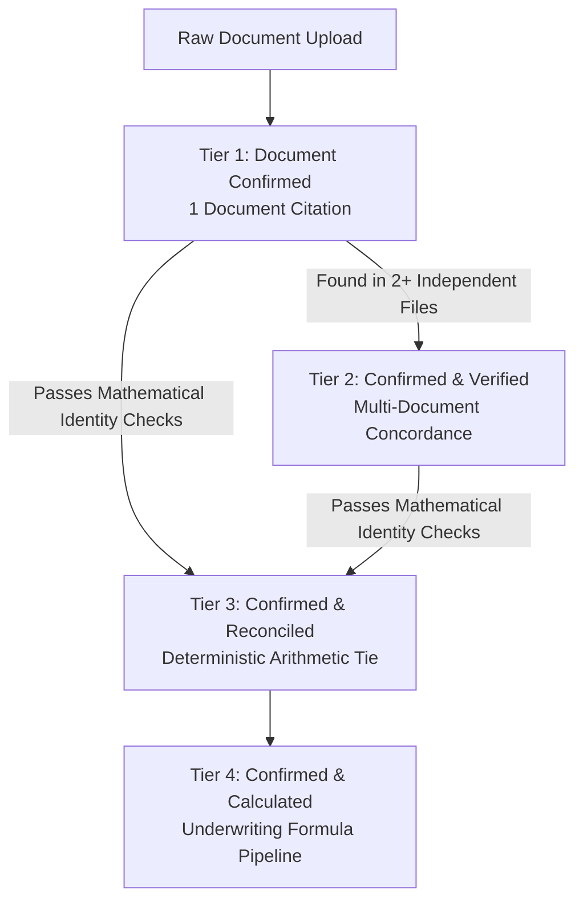

# Data Lineage, Verification Tiers & Origin Taxonomy

This document outlines the end-to-end data lineage, provenance classifications, and verification tiers implemented in the Dillon AI Due Diligence Dashboard. It provides analysts, engineers, and stakeholders with a precise taxonomy of how financial numbers transition from raw documents into confirmed, verified, or reconciled model inputs.

---

## 1. Overview: The Lineage Architecture

Financial due diligence demands absolute transparency. Numbers displayed across the dashboard are never opaque "black-box" outputs; every figure is tagged with an origin badge and backed by citation evidence or deterministic mathematical proof.

The system distinguishes between three broad data modalities:
1. **Document-Extracted Facts**: Figures extracted directly from company-provided source files (P&Ls, balance sheets, tax returns, CIMs, LOIs).
2. **Deterministic Calculations**: Quantities computed via standard accounting or financial formulas (EBITDA, DSCR, IRR, MOIC, Working Capital Peg).
3. **Analyst Underwriting Assumptions**: Discretionary parameters supplied or tuned by the deal team (purchase price, tax rates, senior debt interest, exit multiples).

---

## 2. The Verification Hierarchy: 4 Tiers of Ground Truth

When a financial fact is extracted from deal documents, it is evaluated across a 4-tier verification ladder:

### Tier 1: Document Confirmed
- **Badge / Label**: `Document Confirmed` / `Confirmed`
- **Visual Presentation**: Secondary / Slate badge with `CheckCircle2` icon.
- **Criteria**: The metric was extracted from exactly **one single source document** (e.g. 2024 P&L, Tax Return, or CIM) with a cited row, cell, or page reference, but has not yet been corroborated by a second independent document or arithmetic reconciliation check.
- **Example**: Revenue reported in a 2024 Monthly Financials spreadsheet before the annual tax return is uploaded.

### Tier 2: Confirmed & Verified
- **Badge / Label**: `✓ Confirmed & Verified`
- **Visual Presentation**: Sky Blue / Cyan badge with `CheckCircle2` icon (`bg-sky-500/15 text-sky-700 dark:text-sky-300 border-sky-500/30`).
- **Criteria**: The fact appears in **two or more independent documents** (`citations.length >= 2`) with dollar values agreeing within a 2.0% variance tolerance.
- **Example**: 2023 EBITDA of $703,035 appearing identically in both the confidential information memorandum (`CIM_Northstar.pdf`) and the audited tax return (`2023_Tax_Return.pdf`).

### Tier 3: Confirmed & Reconciled
- **Badge / Label**: `✓ Confirmed & Reconciled`
- **Visual Presentation**: Emerald Green badge with `ShieldCheck` icon (`bg-emerald-500/15 text-emerald-700 dark:text-emerald-300 border-emerald-500/30`).
- **Criteria**: The fact is confirmed by a **deterministic mathematical accounting identity check** (`withinTolerance: true`), verified against the primary document or via multi-document fallback across the deal's financial files.
- **Active Accounting Checks**:
  1. **Gross Profit Identity**: $\text{Revenue} - \text{Cost of Goods Sold} = \text{Gross Profit}$
  2. **Operating Income Identity**: $\text{Gross Profit} - \text{Operating Expenses} = \text{Operating Income}$
  3. **Balance Sheet Equation**: $\text{Total Assets} = \text{Total Liabilities} + \text{Total Equity}$
  4. **Working Capital Identity**: $\text{Current Assets} - \text{Current Liabilities} = \text{Net Working Capital}$

### Tier 4: Confirmed & Calculated
- **Badge / Label**: `Calculated` / `Confirmed & Calculated`
- **Visual Presentation**: Purple / Violet badge with `Calculator` icon.
- **Criteria**: Quantities that cannot be extracted from a historical PDF because they represent deterministic derivations, leverage tests, or future projections.
- **Example Metrics**: Total MOIC (1.02x), Levered IRR, Debt Service Coverage Ratio (DSCR), Net Debt, and Working Capital Pegs.

---

## 3. Unconfirmed, Missing & Non-Documented States

Not every deal metric is immediately available in uploaded files. The engine explicitly flags missing or provisional states:

| Status | Visual Style | Definition & When It Triggers |
| :--- | :--- | :--- |
| **Not Documented / Unconfirmed** | Outline / Neutral badge (`CircleAlert`) | The field was not found in any uploaded document. The card displays a prompt alerting the analyst that an assumption or additional document is required. |
| **Needs Review** | Amber / Warning outline badge | An extracted value had low OCR/parsing confidence or contained ambiguous formatting requiring analyst sign-off. |
| **Analyst Input / Assumption** | Amber / Yellow badge (`UserCheck` / `PenLine`) | Parameters controlled by the deal team rather than extracted from past financials (e.g. Purchase Price, Tax Rate, Senior Debt Term, Capex reserves). |
| **Estimated / Synthesized** | Slate badge (`Brain` / `Sparkles`) | Derived by project-level LLM synthesis when integrating multiple qualitative and quantitative notes into a unified estimate. |
| **Contradicted** | Red / Destructive badge (`AlertTriangle`) | Cross-document values conflict beyond tolerance (e.g., CIM reports $850k EBITDA but Tax Return reports $680k). Triggers an immediate diligence red flag. |

---

## 4. UI Provenance Badges (DataOriginBadge)

Throughout the dashboard (Valuation, Returns, Growth, and Structure tabs), cards feature interactive origin badges:

1. **Document Source** (Green Pill): Clicking opens the **Document Evidence Drawer**, displaying the exact source filename, page, row/cell, confidence rating, and excerpted context.
2. **Calculated** (Purple Pill): Hovering or clicking reveals the mathematical formula, inputs used, and deterministic computation steps.
3. **Analyst Input** (Amber Pill): Indicates a user-editable deal model setting. Changing this value in the input drawer immediately recalculates downstream metrics.
4. **Web Source** (Sky Pill): Indicates qualitative corporate intelligence obtained via Dillon AI web enrichment (domain verification, employee headcount, online presence).

---

## 5. Technical Implementation References

- **Core Lineage Engine**: [`frontend/utils/evidence.ts`](file:///frontend/utils/evidence.ts)
  - `isFactReconciled(key, fact, documents)`: Multi-document identity checker.
  - `getEvidenceStatusPresentation(...)`: Evaluates status, provenance, reconciliation, and citation count into unified UI tokens.
  - `getProvenanceCategoryPresentation(...)`: Categorizes items into document, calculated, analyst, web, or unknown.
- **UI Components**:
  - [`frontend/components/common/DataOriginBadge.tsx`](file:///frontend/components/common/DataOriginBadge.tsx): Interactive badge with hover popover and click-to-evidence handler.
  - [`frontend/components/DealModelReadinessCard.tsx`](file:///frontend/components/DealModelReadinessCard.tsx): Displays high-level counts and per-fact verification status.
