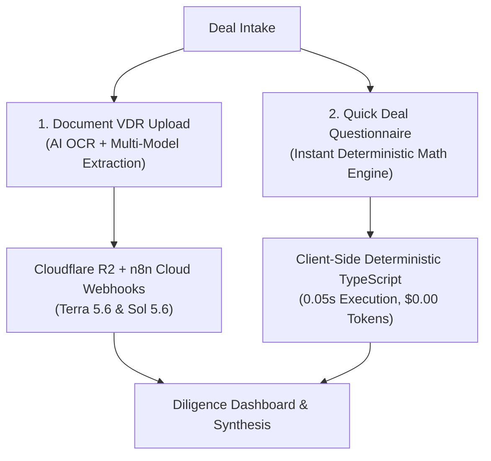

# Quick Deal Questionnaire: Zero-Latency Manual Intake Engine

This document provides a technical and operational overview of the **Quick Deal Questionnaire**, Dillon AI's local-first financial modeling and deal screening engine. Manual entry and structured-file parsing remain token-free; optional AI assistance is used only when the user explicitly requests it.

---

## 1. Overview & Dual-Intake Architecture

In M&A, private equity, and search fund workflows, buyers encounter two distinct intake scenarios:

| Ingestion Mode | Input Medium | Best For | Processing Time | Cost / Token Spend |
| :--- | :--- | :--- | :--- | :--- |
| **Document VDR Upload** | PDF CIMs, Excel P&Ls, Tax Returns, LOIs | Complete data rooms, cross-document contradiction checks, forensic audit trails. | ~42s (batch pipeline) | Live LLM tokens |
| **Quick Deal Questionnaire** | Four-field screen, structured form, local structured-file prefill, optional small-image OCR | Initial broker phone calls, 1-page teasers, confidential screening, scenario modeling. | Instant locally; provider latency for optional AI | $0 locally; provider usage for optional AI |

---

## 2. Quick Screen, Detailed Mode, and Local Prefill

The questionnaire now opens blank so example-company assumptions cannot be mistaken for user data. Users can choose one of three paths:

1. **Quick screen:** Enter deal name, asking price, annual/TTM revenue, and reported EBITDA or SDE. Financial fields accept plain numbers and common formats such as `$5.2M`, `5,200,000`, `850k`, and `5.2 million`.
2. **Add more detail:** Open the full six-section form for balance-sheet assets, financing, growth, and risk inputs. The preliminary screen can be generated first and refined later.
3. **Prefill from a structured summary or pasted stats:** Read a labeled `.docx`, `.xlsx`, `.xlsm`, `.txt`, `.csv`, `.tsv`, or `.json` file in the browser, or paste label/value lines from a broker teaser. The deterministic parser recognizes supported fields, flags conflicting values, and displays a review screen before anything is applied.
4. **Optional image draft:** Send one `.png`, `.jpg`, `.jpeg`, or `.webp` image of at most 2 MB through the authenticated questionnaire relay. The live n8n workflow converts the image to text with LlamaParse, then sends that text through the same provider-selectable extraction and recovery path used by pasted text. The result remains a reviewable questionnaire draft.

The local prefill has a 5 MB limit, rejects legacy `.doc` and macro-enabled `.docm` files, and makes no upload, webhook, Supabase, or model request. It works best with explicit labels such as `Asking Price: $4.8M` and `TTM Revenue: $5.2M`. Every non-empty local result offers an optional **Review with AI** pass over the extracted text for ambiguous wording or unresolved fields; the user still reviews the resulting draft before applying it.

**Review with AI / Extract with AI is BYOK aware.** When the API Key settings contain an active OpenAI, Anthropic, Gemini, or DeepSeek key, the browser sends only that selected key and its configured document primary/backup models through the server-side authenticated relay. With no usable custom key, the workflow uses MergeWorks' managed Terra/Sol route. The primary route retries transient or schema failures three times, changes to the configured backup model on later attempts, and then uses the existing managed salvage chain if needed. The review displays a warning when managed recovery had to finish a failed custom-provider request. Image OCR still uses the managed LlamaParse credential; BYOK applies to the LLM extraction after OCR.

Custom keys are transient and are not stored in `questionnaire_drafts` or the n8n questionnaire table. They do pass through n8n as execution input, so n8n execution-data retention is a shared security consideration for questionnaire, per-document, and synthesis BYOK.

PDFs, audio, video, files above the local limits, multi-file packets, and sources intended to become durable evidence belong in **Deal Intake > Project Intake > Upload Files or Folder**. That pipeline retains the original source, performs media-specific parsing, produces citations, writes document status, and participates in project synthesis. Quick Fill must not duplicate those evidence-grade responsibilities.

The feature is also discoverable from the Command Palette by searching for `word prefill`, `questionnaire`, `docx`, or `broker teaser`.

---

## 3. The 6 Structured Input Categories

The questionnaire is implemented in [`frontend/components/ManualDealIntakeForm.tsx`](../frontend/components/ManualDealIntakeForm.tsx) and accepts structured parameters across 6 financial categories:

### 1. Business Basics
- **Deal / Company Name**: Target business title.
- **Industry Sector**: Manufacturing, HVAC & Trade Services, B2B SaaS, Distribution, Healthcare, etc.
- **Location**: City and State.
- **Employee Headcount**: Total active full-time and part-time staff.
- **Business Description**: Qualitative background on core revenue streams, customer profile, and operations.

### 2. Financials & Earnings Normalization
- **Asking Price**: Seller's requested enterprise valuation ($).
- **Annual Revenue**: Trailing Twelve Months (TTM) gross revenue ($).
- **Reported EBITDA / SDE**: Earnings reported by seller/broker ($).
- **Disallowed Add-Backs**: Personal perks, discretionary travel, one-off owner expenses to be excluded ($).
- **Owner Compensation**: Normalized replacement management cost ($).
- **Gross Margin (%)**: Product/service gross profitability.

### 3. Asset & Liability Breakdown (Balance Sheet)
- **Included Assets**: Cash ($), Accounts Receivable ($), Inventory ($), Equipment & Vehicles ($), Real Estate ($), Intellectual Property ($), Other Assets ($).
- **Assumed Liabilities**: Accounts Payable ($), Short-Term Debt ($), Long-Term Debt ($), Other Liabilities ($).

### 4. Capital Stack & Financing Structure
- **Buyer Equity Contribution (%)**: Target down payment percentage (default: `20%`).
- **Senior Debt Interest Rate (%)**: SBA 7(a) / Commercial bank rate (default: `9.5%`).
- **Amortization Term (Years)**: Loan duration (default: `10 years`).
- **Seller Note Amount ($) & Rate (%)**: Subordinated vendor financing.

### 5. Growth Projections & Exit Multiples
- **Scenario Revenue Growth (%)**: Bear, Base, and Bull revenue trajectories.
- **Scenario EBITDA Margins (%)**: Bear, Base, and Bull operational margins.
- **Target Exit Multiple**: Expected enterprise value multiple at exit (e.g. `5.0x`).

### 6. Risk & Qualitative Factors
- **Top Customer Concentration (%)**: Revenue percentage generated by largest client.
- **Key Person Dependency**: `low`, `moderate`, or `high`.
- **Facility Lease Expiry (Years)**: Remaining lease tenure.
- **Qualitative Diligence Notes**: Customer contract structure, recurring revenue traits, IP ownership.

---

## 4. Deterministic Mathematical Engine

Questionnaire calculations are executed deterministically by [`frontend/utils/manualDealIntake.ts`](../frontend/utils/manualDealIntake.ts). Money inputs are sanitized before model construction, division is guarded, and percentage fields are converted from the form's whole-percent display convention (for example `9.5`) to the deal model's decimal convention (`0.095`). Legacy rows using whole percentages are normalized when hydrated.

### Normalized EBITDA & Valuation Multiple
$$\text{Adjusted EBITDA} = \max(0, \text{Reported EBITDA} - \text{Disallowed Add-backs})$$
$$\text{EBITDA Margin} = \begin{cases} \left(\frac{\text{Adjusted EBITDA}}{\text{Annual Revenue}}\right) \times 100 & \text{if Revenue} > 0 \\ 0\% & \text{if Revenue} \le 0 \end{cases}$$
$$\text{Asking Multiple} = \begin{cases} \frac{\text{Asking Price}}{\text{Adjusted EBITDA}} & \text{if Adjusted EBITDA} > 0 \\ 0\text{x} & \text{otherwise} \end{cases}$$

### Balance Sheet & Net Asset Value (NAV)
$$\text{Total Assets} = \text{Cash} + \text{AR} + \text{Inventory} + \text{Equipment} + \text{Real Estate} + \text{IP} + \text{Other}$$
$$\text{Total Liabilities} = \text{AP} + \text{Short-Term Debt} + \text{Long-Term Debt} + \text{Other Liabilities}$$
$$\text{Net Asset Value (NAV)} = \text{Total Assets} - \text{Total Liabilities}$$
$$\text{Tangible Book Value} = \text{Total Assets} - \text{Intellectual Property} - \text{Total Liabilities}$$
$$\text{Asset Coverage \%} = \left(\frac{\text{Total Assets}}{\text{Asking Price}}\right) \times 100$$

### Capital Stack Sizing
$$\text{Equity Check} = \frac{\text{Asking Price} \times \text{Equity Contribution \%}}{100}$$
$$\text{Senior Debt} = \max(0, \text{Asking Price} - \text{Equity Check} - \text{Seller Note})$$

---

## 5. Automated Deal Verdict & Flag Generation Rules

The engine evaluates qualitative and financial thresholds to generate institutional deal findings:

| Category | Trigger Condition | Automated Output |
| :--- | :--- | :--- |
| **Red Flag** | Customer Concentration $\ge 40\%$ | `"Severe customer concentration: Single top client accounts for X% of total revenue."` |
| **Red Flag** | Key Person Risk is `high` | `"High key person risk: Business relies heavily on the current owner for daily operations."` |
| **Yellow Flag** | Asking Multiple $> 6.0\text{x}$ | `"Asking multiple of X.Xx EBITDA is above median benchmark for this sector."` |
| **Yellow Flag** | Disallowed Add-Backs $> 0$ | `"Identified $X in non-qualifying add-backs (Y% of adjusted EBITDA)."` |
| **Green Flag** | Asking Multiple $\le 4.5\text{x}$ | `"Attractive entry valuation: Asking multiple of X.Xx normalized EBITDA offers strong margin of safety."` |
| **Green Flag** | Customer Concentration $\le 15\%$ | `"Highly diversified customer base: Top client accounts for only X% of volume."` |
| **Negotiation Lever** | Unsubstantiated Add-Backs | `"Disallow $X in personal add-backs to reduce target valuation by $Y."` |
| **Negotiation Lever** | High Customer Concentration | `"Require a 24-month indemnity escrow holdback tied to renewal of the largest account."` |

### Traffic Light & Verdict Logic
- **`RED` / `RENEGOTIATE`**: $\ge 2$ Red Flags, or $1$ Red Flag $+ \ge 2$ Yellow Flags.
- **`YELLOW` / `PROCEED WITH CONDITIONS`**: $1$ Red Flag, or $\ge 2$ Yellow Flags.
- **`GREEN` / `BUY`**: $0$ Red Flags and $\le 1$ Yellow Flag.

---

## 6. Optional 1-Click Example Presets

Users can instantly test realistic industry profiles with one click:

1. **🏭 Precision Manufacturing ($4.8M Asking)**
   - $5.2M Revenue, $1.25M Reported EBITDA, $140K Disallowed Add-Backs, $1.85M Equipment/Vehicles, 38% Customer Concentration.
2. **❄️ HVAC & Commercial Services ($3.2M Asking)**
   - $4.1M Revenue, $890K Reported SDE, $65K Disallowed Add-Backs, and recurring maintenance agreement revenue.
3. **💻 Enterprise B2B SaaS ($6.5M Asking)**
   - $3.4M ARR, 82% Gross Margin, $850K IP Book Value, 18% Customer Concentration, High Capital Efficiency.

---

## 7. Workspace Hydration & State Persistence

Submitting the questionnaire hydrates the entire user interface in real time:

1. **`Overview` Tab**: Displays the 6 KPI cards, Executive Verdict callout, interactive Debt/Equity model, and Red/Green flag callouts.
2. **`Synthesis` Tab**: Renders the complete Deal Memo, Valuation Range (Bear / Base / Bull), Missing Document audit checklist, and Negotiation Levers.
3. **`Projects` Tab**: Creates a permanent project card in the Portfolio Grid with Deal Grade (A-, B, C+), Asking Multiple, and Risk Signal.
4. **`Diligence` Tab**: Stores `<DealName>_Quick_Intake.json`, enabling analysts to review raw inputs or drop real files into the project later.

State is persisted locally in `mergeworks_manual_submissions` and `mergeworks_manual_syntheses` in `localStorage`, surviving browser refreshes.

---

## 8. Testing & Verification

The questionnaire logic is covered by unit tests in [`frontend/utils/manualDealIntake.test.ts`](../frontend/utils/manualDealIntake.test.ts):
- Verifies exact arithmetic for adjusted EBITDA, gross margins, and multiples.
- Verifies that production intake starts blank and that formatted financial values parse correctly.
- Tests NaN resistance against blank strings and malformed user inputs.
- Validates Net Asset Value, Tangible Book Value, and Asset Coverage formulas.
- Asserts Senior Debt and Equity sizing.

Local import behavior is covered by [`frontend/utils/questionnaireImport.test.ts`](../frontend/utils/questionnaireImport.test.ts). It exercises inline and Word-style next-line labels, a real local `.docx` fixture, conflicting values, range validation, unsupported files, and a fail-closed network assertion.

### Native interactive tutorial

After switching Deal Intake to **Quick Deal Questionnaire**, select **Start Tutorial** beside the preset controls. The 26-step tutorial temporarily loads the realistic Apex Precision Dynamics example and demonstrates:

1. The populated four-field quick screen and live deterministic underwriting metrics.
2. Local teaser parsing, source-aware review, and an explicitly labeled mocked AI interpretation that makes no workflow or provider request.
3. Switching into detailed mode and selecting each of the five section tabs in order.
4. Business context, earnings normalization, assets and liabilities, financing assumptions, and risk hypotheses.
5. The final workspace-generation action without actually submitting or persisting the tutorial deal.
6. The generated project in **Overview**, including the initial underwriting snapshot and health view.
7. The **Diligence** representation as one completed structured questionnaire record, so its intentional batch size is `1 of 1`.
8. The assumption-based initial synthesis card in **Synthesis**, including the preliminary judgment and missing-document requests.
9. The persistent project card in **Projects**, where a real deal can be reopened, edited, shared, or enriched with uploaded evidence later.

The downstream screens use a derived tutorial-only project fixture. They do not write to `localStorage`, call the questionnaire submission handler, create a backend project, or trigger n8n/Supabase/model traffic. Exiting the walkthrough removes the temporary project and restores both the workspace tab and questionnaire/prefill state that existed before the demo started.

Browser coverage lives in [`frontend/e2e/quick-deal-questionnaire-tutorial.spec.ts`](../frontend/e2e/quick-deal-questionnaire-tutorial.spec.ts). It verifies blank defaults, formatted four-field generation, review-before-apply behavior, Command Palette discovery, all questionnaire and downstream project targets, cleanup/tab restoration, and that those flows produce no upload, webhook, or model request.
