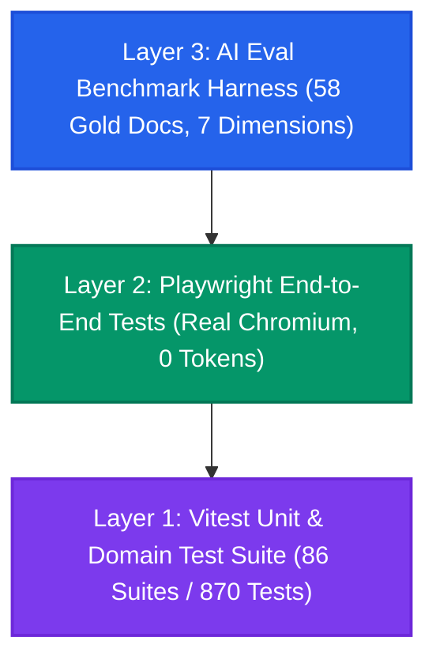

# Testing & Continuous Integration (CI/CD) Architecture

This document provides a comprehensive technical reference for the 3-layer automated testing pyramid and GitHub Actions continuous integration pipeline powering the **Dillon AI / MergeWorks Financial Due Diligence Dashboard**.

---

## 1. The 3-Layer Testing Pyramid



| Layer | Framework / Tool | Scope & Purpose | Execution Latency | Cost / Tokens |
| :--- | :--- | :--- | :--- | :--- |
| **Layer 1: Unit & Domain Tests** | **Vitest** (v4.x) | Core business logic, mathematical reconciliations, duration bounds ($\le 180\text{s}$), latency formatters, and security guards. | ~5.5s (870 tests) | $0.00 / 0 tokens |
| **Layer 2: End-to-End (E2E) Tests** | **Playwright** (Chromium) | Full browser DOM rendering, tab switching, responsive KPI cards, questionnaire tutorial navigation, accordion collapse, carousel pagination, and Command Palette shortcuts. | ~1 min (15 tests) | $0.00 / 0 tokens |
| **Layer 3: AI Eval Benchmark Harness** | **TypeScript + CLI** (`run-evals.ts`) | Golden benchmark validation against 58 M&A data room documents across 7 accuracy dimensions (`EVAL_MIN_SCORE >= 80%`). | ~1.5s (automated) | $0.00 / 0 tokens |

---

## 2. Playwright End-to-End (E2E) Test Suite

The Playwright test suite lives in [`frontend/e2e/`](../frontend/e2e/) and is configured via [`frontend/playwright.config.ts`](../frontend/playwright.config.ts).

### Test Spec Files

1. **[`navigation-and-tabs.spec.ts`](../frontend/e2e/navigation-and-tabs.spec.ts)**
   - Verifies dashboard branding, document title, and header navigation.
   - Tests tab switching across `Overview`, `Synthesis`, `Projects`, `Evals`, and `Diligence`.
   - Validates URL hash deep-linking (`/#synthesis`) to ensure direct link hydration.

2. **[`example-mode-inspection.spec.ts`](../frontend/e2e/example-mode-inspection.spec.ts)**
   - Pre-seeds `localStorage` with `dueDiligenceDashboard.dataSource = 'mock'`.
   - Asserts visibility and accuracy of all **6 primary KPI cards**:
     - `Risk Signal`
     - `AI Confidence`
     - `Detected Document Type`
     - `Extraction Cost`
     - `Extraction Time`
     - `Action Needed`
   - Verifies prominent **"Document Investment Thesis — Start Here"** card and confirms absence of duplicate lower cards.
   - Tests batch document list accordion expanding and collapsing.
   - Tests document carousel pagination (`Next` / `Prev`).

3. **[`mocked-intake-and-synthesis-flow.spec.ts`](../frontend/e2e/mocked-intake-and-synthesis-flow.spec.ts)**
   - Uses Playwright's `page.route()` network interception on `**/api/diligence/*`.
   - Simulates multi-document intake and completed synthesis pass with $0.00 API cost.
   - Asserts that synthesis latency badges render realistic model duration (`~42s`) and validates absence of runaway / infinite timers.

4. **[`interactive-modals-and-actions.spec.ts`](../frontend/e2e/interactive-modals-and-actions.spec.ts)**
   - Validates Command Palette trigger via keyboard shortcut (`Ctrl+K` / `Cmd+K`), search query input, and `Escape` key dismissal.
   - Tests BYOK API Key modal opening and closing.
   - Tests toggling between Dark and Light color themes.

5. **[`quick-deal-questionnaire-tutorial.spec.ts`](../frontend/e2e/quick-deal-questionnaire-tutorial.spec.ts)**
   - Opens the file-free questionnaire in Example Mode and verifies its deterministic metrics.
   - Launches the native eight-step tutorial and confirms that Financials and Risk steps mount their intended targets.
   - Launches the tutorial from the global walkthrough gallery and verifies that the questionnaire opens automatically.
   - Launches the tutorial from the landing-page walkthrough carousel and verifies the exact cross-page tour route.
   - Records unsafe non-GET requests and requires that the tutorial make no upload, webhook, or model request.

---

## 3. How to Run & Visually Debug E2E Tests

### Commands

```bash
# 1. Run all E2E tests headless (Default CI mode)
npm --prefix frontend run test:e2e

# 2. Open the Interactive Playwright UI (Time-Travel, DOM Snapshots, Network Inspector)
npm --prefix frontend run test:e2e:ui

# 3. Run tests with a visible Chrome browser window (Headed Mode)
npm --prefix frontend run test:e2e:headed

# 4. View the last HTML test report with detailed step logs
npm --prefix frontend run test:e2e:report
```

---

## 4. Vitest Unit Test Suite (86 Suites / 870 Tests)

Run all unit tests:
```bash
npm --prefix frontend test
```

### Key Domain Modules Tested:
- **Mathematical Checks & EBITDA Reconciliation**: [`dealMath.test.ts`](../frontend/utils/dealMath.test.ts), [`financialMetrics.test.ts`](../frontend/utils/financialMetrics.test.ts), [`ebitdaQualityGrade.test.ts`](../frontend/utils/ebitdaQualityGrade.test.ts).
- **Latency & Duration Bounding**: [`diligenceDashboardUtils.test.ts`](../frontend/utils/diligenceDashboardUtils.test.ts), [`processingTime.test.ts`](../frontend/utils/processingTime.test.ts).
- **Multipart Upload & Egress Guards**: [`storedFileMultipart.test.ts`](../frontend/utils/storedFileMultipart.test.ts), [`supabaseStorage.test.ts`](../frontend/services/supabaseStorage.test.ts).
- **State Recovery & Batch Stop**: [`stopBatchSubmission.test.ts`](../frontend/utils/stopBatchSubmission.test.ts), [`batchState.test.ts`](../frontend/utils/batchState.test.ts).

---

## 5. Automated AI Evaluation Harness (58 Golden Benchmarks)

Run the eval harness:
```bash
npx tsx scripts/run-evals.ts
```

- Compares model extractions against **58 gold-standard M&A deal room documents** across 7 dimensions (Numeric Accuracy, Unit Precision, Semantic Completeness, Citations, Contradiction Detection, Hallucination Prevention, Temporal Grounding).
- **CI Gate**: Exits non-zero if total score falls below **80%** (`EVAL_MIN_SCORE=80`).

---

## 6. GitHub Actions CI/CD Pipeline

The CI workflow is defined in [`.github/workflows/eval-regression.yml`](../.github/workflows/eval-regression.yml) and executes on every `push` and `pull_request` targeting `main`.

### Workflow Step Breakdown:
1. **Environment Setup**: Provisions Ubuntu container with Node `22.x`.
2. **Dependency Installation**: Runs `npm ci` (root) and `npm ci --prefix frontend`.
3. **TypeScript Typecheck Gate**: Runs `npm --prefix frontend run typecheck` (`tsc --noEmit`).
4. **Vitest Unit Test Gate**: Runs `npm --prefix frontend test` (870 tests).
5. **Production Build Gate**: Runs `npm --prefix frontend run build` (Vite bundle verification).
6. **Playwright Chromium Install & E2E Gate**: Installs Chromium binaries and runs `npm --prefix frontend run test:e2e` (15 browser tests), then uploads the HTML report even after a failure.
7. **AI Eval Regression Gate**: Runs `npx tsx scripts/run-evals.ts` with `EVAL_MIN_SCORE=80`.
8. **Summary & Artifact Upload**: Generates GitHub Step Summary and uploads eval report artifacts.
